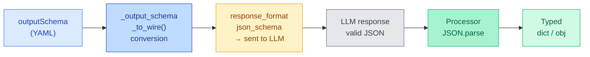

import { Aside, Tabs, TabItem } from '@astrojs/starlight/components';

## Overview

By default, an LLM returns free-form text. When you define an **`outputSchema`**
in your `.prompty` frontmatter, the runtime converts it to the provider's
`response_format` parameter so the model is **constrained to return valid JSON**
matching your schema. The processor then automatically parses the JSON string into
a Python `dict` or JavaScript object — no manual `JSON.parse()` needed.



---

## Defining Output Schema

Add an `outputSchema` block to your frontmatter with the properties you expect in
the response. Each property has a `kind` (type) and optional `description`.

```yaml title="weather.prompty"
---
name: weather-report
model:
  id: gpt-4o-mini
  provider: openai
  apiType: chat
  connection:
    kind: key
    apiKey: ${env:OPENAI_API_KEY}
outputSchema:
  properties:
    - name: city
      kind: string
      description: The city name
    - name: temperature
      kind: integer
      description: Temperature in degrees Fahrenheit
    - name: conditions
      kind: string
      description: Current weather conditions
---
system:
You are a weather assistant. Return the current weather for the requested city.

user:
What's the weather in {{city}}?
```

The runtime converts this to an OpenAI-compatible `response_format` with
`type: "json_schema"`, ensuring the LLM **must** return a JSON object with exactly
those three fields.

---

## How It Works

Under the hood, the executor performs three steps when `outputSchema` is present:

1. **Schema conversion** — `_output_schema_to_wire()` translates each `Property`
   (with `kind`, `description`, `required`) into a standard JSON Schema object.
   The result is wrapped in an OpenAI `response_format` parameter:

   ```json
   {
     "type": "json_schema",
     "json_schema": {
       "name": "output_schema",
       "strict": true,
       "schema": {
         "type": "object",
         "properties": {
           "city": { "type": "string", "description": "The city name" },
           "temperature": { "type": "integer", "description": "Temperature in degrees Fahrenheit" },
           "conditions": { "type": "string", "description": "Current weather conditions" }
         },
         "required": ["city", "temperature", "conditions"],
         "additionalProperties": false
       }
     }
   }
   ```

2. **LLM constrained generation** — the model is forced to return valid JSON matching
   the schema. No malformed output, no missing fields.

3. **Processor auto-parse** — the processor detects that `outputSchema` is defined and
   calls `json.loads()` on the response content, returning a native `dict` (Python) or
   object (JavaScript) instead of a raw string.

<Aside type="note">
  Structured output uses OpenAI's **strict mode** — `additionalProperties: false` is
  set automatically, and all properties are marked as `required`. This guarantees the
  model returns exactly the fields you specified.
</Aside>

---

## Usage

With structured output, `execute()` returns a parsed dictionary/object directly:

<Tabs>
  <TabItem label="Python">
    ```python
    from prompty import execute

    result = execute("weather.prompty", inputs={"city": "Seattle"})

    # result is already a dict — no JSON.parse needed
    print(result["city"])         # "Seattle"
    print(result["temperature"])  # 62
    print(result["conditions"])   # "Partly cloudy"
    print(type(result))           # <class 'dict'>
    ```
  </TabItem>
  <TabItem label="Python (async)">
    ```python
    from prompty import execute_async

    result = await execute_async("weather.prompty", inputs={"city": "Seattle"})
    print(result["temperature"])  # 62
    ```
  </TabItem>
  <TabItem label="TypeScript">
    ```typescript
    import { execute } from "@prompty/core";

    const result = await execute("weather.prompty", { city: "Seattle" });

    // result is already a parsed object
    console.log(result.city);         // "Seattle"
    console.log(result.temperature);  // 62
    console.log(result.conditions);   // "Partly cloudy"
    ```
  </TabItem>
</Tabs>

---

## Without Output Schema

If you **don't** define `outputSchema`, the processor returns the raw text content
from the LLM response. You can still ask the model to return JSON in your prompt
instructions, but there's no schema enforcement or automatic parsing.

<Tabs>
  <TabItem label="With outputSchema">
    ```python
    # outputSchema defined → dict returned automatically
    result = execute("weather.prompty", inputs={"city": "Seattle"})
    print(type(result))  # <class 'dict'>
    print(result["temperature"])  # 62
    ```
  </TabItem>
  <TabItem label="Without outputSchema">
    ```python
    # No outputSchema → raw string returned
    result = execute("chat.prompty", inputs={"city": "Seattle"})
    print(type(result))  # <class 'str'>
    # You'd need to parse manually:
    import json
    data = json.loads(result)  # may fail if LLM didn't return valid JSON
    ```
  </TabItem>
</Tabs>

<Aside type="caution">
  Without `outputSchema`, the LLM may return malformed JSON, add extra commentary
  around the JSON block, or omit fields. Always prefer defining a schema when you
  need structured data.
</Aside>

---

## Nested Objects

For complex responses, use `kind: object` with nested `properties` to define
multi-level schemas:

```yaml title="detailed-weather.prompty"
---
name: detailed-weather
model:
  id: gpt-4o-mini
  provider: openai
  apiType: chat
  connection:
    kind: key
    apiKey: ${env:OPENAI_API_KEY}
outputSchema:
  properties:
    - name: city
      kind: string
    - name: current
      kind: object
      properties:
        - name: temperature
          kind: integer
          description: Temperature in °F
        - name: humidity
          kind: integer
          description: Humidity percentage
        - name: conditions
          kind: string
    - name: forecast
      kind: array
      description: Next 3 days
---
system:
Return current weather and a 3-day forecast for the requested city.

user:
Weather for {{city}}?
```

The result is a nested dictionary:

```python
result = execute("detailed-weather.prompty", inputs={"city": "Portland"})

print(result["city"])                     # "Portland"
print(result["current"]["temperature"])   # 58
print(result["current"]["humidity"])      # 72
print(result["forecast"])                 # [{"day": "Mon", ...}, ...]
```

<Aside type="tip">
  Keep your output schemas as flat as possible — deeply nested schemas increase
  token usage and can slow down constrained generation. Use nesting only when
  the data genuinely has hierarchical structure.
</Aside>
