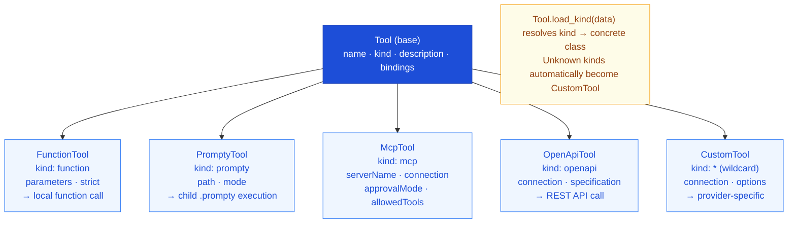

import { Aside, Tabs, TabItem } from '@astrojs/starlight/components';

## Overview

Tools extend what an LLM can do beyond generating text. Define them in the
`.prompty` frontmatter under the `tools:` key. When the prompt executes, the
runtime passes tool definitions to the LLM as part of the API call. If the model
decides to use a tool, the **agent loop** handles calling the function and
feeding the result back into the conversation.

```yaml
tools:
  - name: get_weather
    kind: function
    description: Get current weather for a city
    parameters:
      - name: city
        kind: string
        required: true
```

Every tool has a `name`, a `kind` that determines its type, and an optional
`description`. Beyond that, each kind carries its own fields. Prompty supports
five tool kinds — plus a wildcard catch-all.

---

## Tool Types at a Glance



---

## FunctionTool — `kind: function`

Function tools define **local functions** that the runtime can call directly when
the LLM requests them. This is the most common tool type — you provide a
function name, description, and a parameter schema, and the executor maps tool
calls to your Python functions at runtime.

```yaml
tools:
  - name: get_weather
    kind: function
    description: Get current weather for a city
    parameters:
      - name: city
        kind: string
        description: City name
        required: true
      - name: units
        kind: string
        description: Temperature units
        default: celsius
```

### Strict Mode

Set `strict: true` to constrain the LLM to output **only** arguments that match
the exact parameter schema. This adds `"strict": true` to the function
definition and `"additionalProperties": false` to the JSON Schema sent to the
API — preventing the model from hallucinating extra parameters.

```yaml
tools:
  - name: get_weather
    kind: function
    description: Get current weather for a city
    strict: true
    parameters:
      - name: city
        kind: string
        required: true
```

<Aside type="tip">
  Strict mode works with OpenAI and Microsoft Foundry. It is especially useful when
  the tool has a rigid contract and you want to guarantee the model respects it.
</Aside>

---

## PromptyTool — `kind: prompty`

Prompty tools let one `.prompty` file **call another** as a tool. Instead of
writing a function, you point at a child `.prompty` file — the runtime loads it,
sends the LLM-provided arguments as inputs, and returns the result.

```yaml
tools:
  - name: summarize
    kind: prompty
    description: Summarize a piece of text
    path: ./summarize.prompty
    mode: single
    parameters:
      - name: text
        kind: string
        description: The text to summarize
    bindings:
      - name: context
        input: document
```

| Field | Description |
|-------|-------------|
| `path` | Relative path to the child `.prompty` file (resolved from the parent's location) |
| `mode` | `single` (default) — one LLM call via `prepare` + `run`. `agentic` — full agent loop via `invokeAgent` |
| `parameters` | Optional parameter schema. If omitted, the child's `inputs` are used automatically |
| `bindings` | Map parent inputs → child parameters (the bound parameters are stripped from the wire schema) |

### Wire Projection

When sent to the LLM, a PromptyTool is **projected** as a standard function
tool. The runtime:

1. Loads the child `.prompty` file
2. Uses its `inputs` as the function `parameters`
3. Strips any bound parameter names from the schema
4. Uses the tool's `description` (or the child's if not set)

The LLM sees it as a regular function call — it doesn't know it's backed by
another prompt.

<Aside type="tip">
  PromptyTool is ideal for **composable prompt chains** — break complex tasks
  into focused sub-prompts (summarization, extraction, classification) and let
  the agent decide when to use each one.
</Aside>

---

## McpTool — `kind: mcp`

MCP (Model Context Protocol) tools connect to an **external MCP server** that
exposes a set of capabilities. You reference the server by name and optionally
restrict which tools the model can access.

```yaml
tools:
  - name: filesystem
    kind: mcp
    serverName: fs-server
    connection:
      kind: reference
      name: my-mcp-server
    approvalMode:
      kind: always
    allowedTools:
      - read_file
      - list_directory
```

| Field | Description |
|-------|-------------|
| `serverName` | Identifier of the MCP server to connect to |
| `connection` | How to reach the server (any [Connection](/core-concepts/connections/) type) |
| `approvalMode` | When tool calls need approval — `always`, `never`, or `specify` (with per-tool lists) |
| `allowedTools` | Whitelist of tool names the model may invoke (optional) |

<Aside>
  The MCP server definition itself lives outside the `.prompty` file. The
  `connection` block tells Prompty how to reach it — often via a
  `ReferenceConnection` that resolves at runtime.
</Aside>

---

## OpenApiTool — `kind: openapi`

OpenAPI tools let the LLM call a **REST API** described by an OpenAPI
specification. Prompty reads the spec to understand available operations and
translates tool calls into HTTP requests.

```yaml
tools:
  - name: weather_api
    kind: openapi
    connection:
      kind: key
      endpoint: https://api.weather.com
      apiKey: ${env:WEATHER_API_KEY}
    specification: ./weather.openapi.json
```

| Field | Description |
|-------|-------------|
| `connection` | Endpoint and auth for the API (any [Connection](/core-concepts/connections/) type) |
| `specification` | Path to an OpenAPI JSON/YAML spec (relative to the `.prompty` file) |

<Aside type="tip">
  The `specification` path is resolved relative to the `.prompty` file's
  directory, just like `$&#123;file:...&#125;` references in other frontmatter fields.
</Aside>

---

## CustomTool — `kind: *` (Wildcard)

Any `kind` value that doesn't match `function`, `mcp`, or `openapi` is caught
by the **CustomTool** wildcard. This is the extensibility escape hatch — use it
to integrate with tool providers that Prompty doesn't have built-in support for.

```yaml
tools:
  - name: my_tool
    kind: my_custom_provider
    connection:
      kind: key
      endpoint: https://custom.example.com
    options:
      setting: value
```

| Field | Description |
|-------|-------------|
| `connection` | Optional connection for the custom provider |
| `options` | Free-form dictionary passed through to the provider |

The runtime loads these as `CustomTool` instances. Your executor or a plugin is
responsible for interpreting the `kind` and `options` at execution time.

---

## Tool Bindings

All tool types support optional **bindings** that map between the tool's
parameters and the prompt's input schema. Use bindings when the tool's parameter
names don't match your prompt's input variable names.

```yaml
tools:
  - name: search
    kind: function
    description: Search for documents
    bindings:
      - name: query
        input: userQuestion
    parameters:
      - name: query
        kind: string
        required: true
```

In this example, the tool parameter `query` is bound to the prompt input
`userQuestion` — so the value of `userQuestion` is automatically passed as
`query` when the tool is invoked.

---

## Using Tools at Runtime

Tools defined in the frontmatter are sent to the LLM as part of the API
request. To actually **execute** the tool calls the model returns, use
`invoke_agent` — which runs the agent loop: call the LLM, execute any
requested tools, feed results back, and repeat until the model produces a final
response.

<Tabs>
  <TabItem label="Python">
    ```python
    from prompty import load, invoke_agent, tool, bind_tools

    @tool
    def get_weather(city: str, units: str = "celsius") -> str:
        """Get the current weather for a city."""
        return f"72°F and sunny in {city}"

    agent = load("agent.prompty")
    tools = bind_tools(agent, [get_weather])

    result = invoke_agent(agent, inputs={"question": "Weather in Seattle?"}, tools=tools)
    ```
  </TabItem>
  <TabItem label="TypeScript">
    ```typescript
    import { load, invokeAgent, tool, bindTools } from "@prompty/core";

    const getWeather = tool(
      (city: string, units = "celsius") => `72°F and sunny in ${city}`,
      {
        name: "get_weather",
        description: "Get the current weather for a city",
        parameters: [
          { name: "city", kind: "string", required: true },
          { name: "units", kind: "string", default: "celsius" },
        ],
      },
    );

    const agent = await load("agent.prompty");
    const tools = bindTools(agent, [getWeather]);

    const result = await invokeAgent(agent, { question: "Weather in Seattle?" }, { tools });
    ```
  </TabItem>
  <TabItem label="C#">
    ```csharp
    using Prompty.Core;

    public class WeatherService
    {
        [Tool(Name = "get_weather", Description = "Get the current weather")]
        public string GetWeather(string city, string units = "celsius")
        {
            return $"72°F and sunny in {city}";
        }
    }

    var agent = PromptyLoader.Load("agent.prompty");
    var service = new WeatherService();
    var tools = ToolAttribute.BindTools(agent, service);

    var result = await Pipeline.InvokeAgentAsync(agent, inputs, tools: tools);
    ```
  </TabItem>
</Tabs>

<Tabs>
  <TabItem label="Python">
    ```python
    result = invoke_agent(
        agent,
        inputs={"question": "Weather in Seattle?"},
        tools=tools,
    )
    print(result)
    ```
  </TabItem>
  <TabItem label="Python (async)">
    ```python
    result = await invoke_agent_async(
        agent,
        inputs={"question": "Weather in Seattle?"},
        tools=tools,
    )
    print(result)
    ```
  </TabItem>
  <TabItem label="TypeScript">
    ```typescript
    const result = await invokeAgent(agent, {
      question: "Weather in Seattle?",
    }, { tools });
    console.log(result);
    ```
  </TabItem>
  <TabItem label="C#">
    ```csharp
    var result = await Pipeline.InvokeAgentAsync(
        agent, inputs, tools: tools, maxIterations: 10);

    Console.WriteLine(result);
    ```
  </TabItem>
</Tabs>

<Aside type="tip">
  `invoke_agent` / `executeAgent` / `InvokeAgentAsync` runs the full agent loop —
  it calls the LLM, executes any returned tool calls, appends the results, and
  loops until the model returns a final response. Use `invoke` / `run` for
  single-turn calls where you handle tool responses yourself.
</Aside>

---

## Custom Tool Registry

Prompty uses a **two-layer registry** for extensible tool support. This lets you
add custom tool kinds (beyond the built-in `function`, `mcp`, `openapi`) and
control both how they're presented to the LLM and how they're executed.

### Layer 1: Wire Projection — `registerTool()`

The **tool projector** converts a tool definition from your `.prompty` frontmatter
into the wire format the LLM expects (typically an OpenAI-style function definition).

<Tabs>
  <TabItem label="Python">
    ```python
    from prompty import register_tool

    def my_tool_projector(tool) -> dict:
        """Convert a custom tool kind into an OpenAI function definition."""
        return {
            "type": "function",
            "function": {
                "name": tool.name,
                "description": tool.description,
                "parameters": {
                    "type": "object",
                    "properties": {
                        p.name: {"type": p.kind, "description": p.description}
                        for p in tool.parameters.properties
                    },
                },
            },
        }

    register_tool("my_provider", my_tool_projector)
    ```
  </TabItem>
  <TabItem label="TypeScript">
    ```typescript
    import { registerTool } from "@prompty/core";
    import type { Tool } from "@prompty/core";

    function myToolProjector(tool: Tool): object {
      return {
        type: "function",
        function: {
          name: tool.name,
          description: tool.description,
          parameters: { /* ... */ },
        },
      };
    }

    registerTool("my_provider", myToolProjector);
    ```
  </TabItem>
  <TabItem label="C#">
    ```csharp
    using Prompty.Core;

    // Register a name-based tool function
    ToolDispatch.RegisterTool("calculator", async (args) =>
    {
        var parsed = ToolDispatch.ParseArguments(args);
        var expression = parsed["expression"]?.ToString() ?? "";
        return Evaluate(expression).ToString();
    });

    // Register a kind-based tool handler for a custom provider
    // Handles ALL tools with kind: "my_provider"
    ToolDispatch.RegisterToolHandler("my_provider", new MyToolHandler());
    ```
  </TabItem>
</Tabs>

When the executor sends tools to the LLM, it calls each tool's registered
projector to produce the wire-format definition. Built-in kinds (`function`,
`prompty`) have projectors pre-registered.

### Layer 2: Dispatch — `registerToolHandler()`

The **tool handler** is called during the agent loop when the LLM requests a
tool call. It receives the tool definition and the arguments from the LLM, and
returns the result string.

<Tabs>
  <TabItem label="Python">
    ```python
    from prompty import register_tool_handler

    def my_tool_handler(tool, args: dict) -> str:
        """Execute a custom tool kind during the agent loop."""
        # Use tool.connection, tool.options, etc.
        result = call_my_service(tool.connection.endpoint, args)
        return str(result)

    register_tool_handler("my_provider", my_tool_handler)
    ```
  </TabItem>
  <TabItem label="TypeScript">
    ```typescript
    import { registerToolHandler } from "@prompty/core";
    import type { Tool } from "@prompty/core";

    function myToolHandler(tool: Tool, args: Record<string, unknown>): string {
      // Use tool.connection, tool.options, etc.
      return callMyService(tool.connection.endpoint, args);
    }

    registerToolHandler("my_provider", myToolHandler);
    ```
  </TabItem>
  <TabItem label="C#">
    ```csharp
    using Prompty.Core;

    // Kind-based handler: implement a class for the custom tool kind
    ToolDispatch.RegisterToolHandler("my_provider", new MyToolHandler());

    // Dispatch follows this order:
    // 1. userTools dict (passed to InvokeAgentAsync)
    // 2. Name registry (RegisterTool)
    // 3. Kind handler (RegisterToolHandler)
    // 4. Wildcard "*" handler
    // 5. Error — tool not found

    // Parse LLM-returned JSON arguments into a dictionary
    var args = ToolDispatch.ParseArguments(jsonArgs);
    var city = args["city"]?.ToString() ?? "unknown";
    ```
  </TabItem>
</Tabs>

### When Do You Need This?

| Scenario | Register projector? | Register handler? |
|---|---|---|
| Custom tool kind (e.g., a proprietary API) | ✅ Yes | ✅ Yes |
| Override wire format for built-in kind | ✅ Yes | No — use `tools` dict in `invoke_agent` |
| Custom execution for built-in kind | No | ✅ Yes |
| Standard `function` tools | No — pre-registered | No — use `tools` dict |

<Aside type="tip">
  For most use cases, you don't need the registry at all — just pass your
  functions in the `tools` dict to `invoke_agent()`. The registry is for
  **custom tool kinds** that need special wire projection or dispatch logic.
</Aside>

## Next Steps

- [Agent Tool Calling How-To](/how-to/agent-tool-calling/) — practical guide to building tool-calling agents
- [Chat Assistant Tutorial](/tutorials/chat-assistant/) — end-to-end tutorial with tools
- [Prompt Composition](/how-to/prompt-composition/) — composing prompts with PromptyTool
