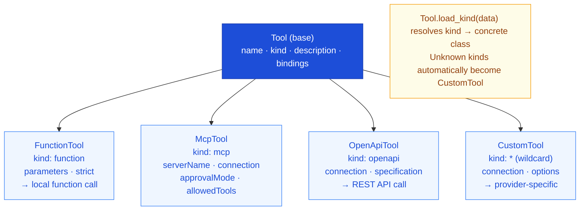

import { Aside, Tabs, TabItem } from '@astrojs/starlight/components';

## Overview

Tools extend what an LLM can do beyond generating text. Define them in the
`.prompty` frontmatter under the `tools:` key. When the prompt executes, the
runtime passes tool definitions to the LLM as part of the API call. If the model
decides to use a tool, the **agent loop** handles calling the function and
feeding the result back into the conversation.

```yaml
tools:
  - name: get_weather
    kind: function
    description: Get current weather for a city
    parameters:
      - name: city
        kind: string
        required: true
```

Every tool has a `name`, a `kind` that determines its type, and an optional
`description`. Beyond that, each kind carries its own fields. Prompty supports
four tool kinds — backed by AgentSchema types — plus a wildcard catch-all.

---

## Tool Types at a Glance



---

## FunctionTool — `kind: function`

Function tools define **local functions** that the runtime can call directly when
the LLM requests them. This is the most common tool type — you provide a
function name, description, and a parameter schema, and the executor maps tool
calls to your Python functions at runtime.

```yaml
tools:
  - name: get_weather
    kind: function
    description: Get current weather for a city
    parameters:
      - name: city
        kind: string
        description: City name
        required: true
      - name: units
        kind: string
        description: Temperature units
        default: celsius
```

### Strict Mode

Set `strict: true` to constrain the LLM to output **only** arguments that match
the exact parameter schema. This adds `"strict": true` to the function
definition and `"additionalProperties": false` to the JSON Schema sent to the
API — preventing the model from hallucinating extra parameters.

```yaml
tools:
  - name: get_weather
    kind: function
    description: Get current weather for a city
    strict: true
    parameters:
      - name: city
        kind: string
        required: true
```

<Aside type="tip">
  Strict mode works with OpenAI and Microsoft Foundry. It is especially useful when
  the tool has a rigid contract and you want to guarantee the model respects it.
</Aside>

---

## McpTool — `kind: mcp`

MCP (Model Context Protocol) tools connect to an **external MCP server** that
exposes a set of capabilities. You reference the server by name and optionally
restrict which tools the model can access.

```yaml
tools:
  - name: filesystem
    kind: mcp
    serverName: fs-server
    connection:
      kind: reference
      name: my-mcp-server
    approvalMode:
      kind: always
    allowedTools:
      - read_file
      - list_directory
```

| Field | Description |
|-------|-------------|
| `serverName` | Identifier of the MCP server to connect to |
| `connection` | How to reach the server (any [Connection](/core-concepts/connections/) type) |
| `approvalMode` | When tool calls need approval — `always`, `never`, or custom |
| `allowedTools` | Whitelist of tool names the model may invoke (optional) |

<Aside>
  The MCP server definition itself lives outside the `.prompty` file. The
  `connection` block tells Prompty how to reach it — often via a
  `ReferenceConnection` that resolves at runtime.
</Aside>

---

## OpenApiTool — `kind: openapi`

OpenAPI tools let the LLM call a **REST API** described by an OpenAPI
specification. Prompty reads the spec to understand available operations and
translates tool calls into HTTP requests.

```yaml
tools:
  - name: weather_api
    kind: openapi
    connection:
      kind: key
      endpoint: https://api.weather.com
      apiKey: ${env:WEATHER_API_KEY}
    specification: ./weather.openapi.json
```

| Field | Description |
|-------|-------------|
| `connection` | Endpoint and auth for the API (any [Connection](/core-concepts/connections/) type) |
| `specification` | Path to an OpenAPI JSON/YAML spec (relative to the `.prompty` file) |

<Aside type="tip">
  The `specification` path is resolved relative to the `.prompty` file's
  directory, just like `$&#123;file:...&#125;` references in other frontmatter fields.
</Aside>

---

## CustomTool — `kind: *` (Wildcard)

Any `kind` value that doesn't match `function`, `mcp`, or `openapi` is caught
by the **CustomTool** wildcard. This is the extensibility escape hatch — use it
to integrate with tool providers that Prompty doesn't have built-in support for.

```yaml
tools:
  - name: my_tool
    kind: my_custom_provider
    connection:
      kind: key
      endpoint: https://custom.example.com
    options:
      setting: value
```

| Field | Description |
|-------|-------------|
| `connection` | Optional connection for the custom provider |
| `options` | Free-form dictionary passed through to the provider |

The runtime loads these as `CustomTool` instances. Your executor or a plugin is
responsible for interpreting the `kind` and `options` at execution time.

---

## Tool Bindings

All tool types support optional **bindings** that map between the tool's
parameters and the prompt's input schema. Use bindings when the tool's parameter
names don't match your prompt's input variable names.

```yaml
tools:
  - name: search
    kind: function
    description: Search for documents
    bindings:
      - name: query
        input: userQuestion
    parameters:
      - name: query
        kind: string
        required: true
```

In this example, the tool parameter `query` is bound to the prompt input
`userQuestion` — so the value of `userQuestion` is automatically passed as
`query` when the tool is invoked.

---

## Using Tools at Runtime

Tools defined in the frontmatter are sent to the LLM as part of the API
request. To actually **execute** the tool calls the model returns, use
`execute_agent` — which runs the agent loop: call the LLM, execute any
requested tools, feed results back, and repeat until the model produces a final
response.

<Tabs>
  <TabItem label="Python">
    ```python
    import prompty

    def get_weather(city: str, units: str = "celsius") -> str:
        return f"72°F and sunny in {city}"

    result = prompty.execute_agent(
        "agent.prompty",
        inputs={"question": "Weather in Seattle?"},
        tools={"get_weather": get_weather},
    )
    ```
  </TabItem>
  <TabItem label="TypeScript">
    ```typescript
    import { executeAgent } from "@prompty/core";
    import "@prompty/openai";

    function getWeather(city: string, units: string = "celsius"): string {
      return `72°F and sunny in ${city}`;
    }

    const result = await executeAgent("agent.prompty", {
      inputs: { question: "Weather in Seattle?" },
      tools: { get_weather: getWeather },
    });
    ```
  </TabItem>
</Tabs>

<Tabs>
  <TabItem label="Python">
    ```python
    result = prompty.execute_agent(
        "agent.prompty",
        inputs={"question": "Weather in Seattle?"},
        tools={"get_weather": get_weather},
    )
    print(result)
    ```
  </TabItem>
  <TabItem label="Python (async)">
    ```python
    result = await prompty.execute_agent_async(
        "agent.prompty",
        inputs={"question": "Weather in Seattle?"},
        tools={"get_weather": get_weather},
    )
    print(result)
    ```
  </TabItem>
  <TabItem label="TypeScript">
    ```typescript
    const result = await executeAgent("agent.prompty", {
      inputs: { question: "Weather in Seattle?" },
      tools: { get_weather: getWeather },
    });
    console.log(result);
    ```
  </TabItem>
</Tabs>

<Aside type="caution">
  Without `execute_agent`, tools are only **declared** to the model — the
  runtime won't execute tool calls automatically. Use `execute` or `run` when
  you want to handle tool calls yourself.
</Aside>
