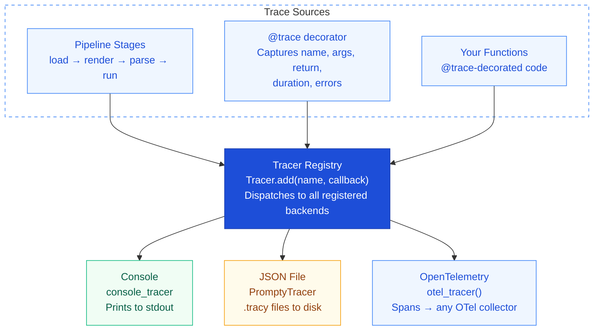

import { Aside, Tabs, TabItem } from '@astrojs/starlight/components';

## Overview

Every pipeline call in Prompty is **automatically traced**. The tracing system
uses a pluggable backend architecture — register as many trace consumers as you
need. Traces capture the full lifecycle of a prompt: loading, rendering,
parsing, execution, and processing.

Out of the box, tracing is a **zero-overhead no-op**. It only becomes active
when you register one or more backends.

---

## Architecture



---

## Tracer Registry

Register trace backends at application startup. Each backend is a callback
function that receives structured trace data. You can register as many as you
like — every trace event is dispatched to **all** registered backends.

<Tabs>
  <TabItem label="Python">
    ```python
    from prompty import Tracer, PromptyTracer

    # JSON file tracer — writes structured traces to disk
    Tracer.add("json", PromptyTracer("./traces").tracer)

    # Console tracer — prints to stdout
    from prompty.tracing.tracer import console_tracer
    Tracer.add("console", console_tracer)
    ```
  </TabItem>
  <TabItem label="TypeScript">
    ```typescript
    import { Tracer, PromptyTracer, consoleTracer } from "@prompty/core";

    // JSON file tracer — writes structured traces to disk
    const promptyTracer = new PromptyTracer("./traces");
    Tracer.add("json", promptyTracer.tracer);

    // Console tracer — prints to stdout
    Tracer.add("console", consoleTracer);
    ```
  </TabItem>
  <TabItem label="C#">
    ```csharp
    using Prompty.Core.Tracing;

    // Console tracer — prints to stdout
    Tracer.Add("console", ConsoleTracer.Factory);

    // JSON file tracer — writes .tracy files to disk
    new PromptyTracer().Register();
    ```
  </TabItem>
  <TabItem label="Rust">
    ```rust
    use prompty::{Tracer, PromptyTracer, console_tracer};

    // JSON file tracer — writes structured traces to disk
    let pt = PromptyTracer::new("./traces");
    Tracer::register("json", pt.tracer());

    // Console tracer — prints to stdout
    Tracer::register("console", console_tracer);
    ```
  </TabItem>
</Tabs>

<Aside type="tip">
  Register backends **once** at startup(e.g. in your `main()` or app factory).
  Every subsequent pipeline call will automatically dispatch to all registered
  backends.
</Aside>

---

## The `@trace` Decorator

Wrap any function to include it in the trace tree. When a traced function calls
other traced functions (including Prompty's built-in pipeline), they appear as
**nested child spans**.

<Tabs>
  <TabItem label="Python">
    ```python
    from prompty import trace, invoke

    @trace
    def my_business_logic(query: str) -> str:
        result = invoke("search.prompty", inputs={"q": query})
        return result
    ```
  </TabItem>
  <TabItem label="TypeScript">
    ```typescript
    import { trace, invoke } from "@prompty/core";

    async function myBusinessLogic(query: string): Promise<string> {
      const result = await invoke("search.prompty", { inputs: { q: query } });
      return process(result);
    }

    const tracedLogic = trace(myBusinessLogic, "myBusinessLogic");
    ```
  </TabItem>
  <TabItem label="C#">
    ```csharp
    using Prompty.Core;
    using Prompty.Core.Tracing;

    var result = await Trace.TraceAsync("myBusinessLogic", async (attr) =>
    {
        attr("query", query);
        var output = await Pipeline.InvokeAsync("search.prompty",
            new() { ["q"] = query });
        attr("output", output);
        return output;
    });
    ```
  </TabItem>
  <TabItem label="Rust">
    ```rust
    use prompty::trace_async;
    use serde_json::json;

    let result = trace_async("my_business_logic", json!({"query": &query}), async {
        let output = prompty::invoke_from_path(
            "search.prompty",
            Some(&json!({"q": &query})),
        ).await?;
        Ok(output)
    }).await;
    ```
  </TabItem>
</Tabs>

The decorator automatically captures:

| Field | Description |
|---|---|
| **Function name** | The `__name__` of the decorated function |
| **Arguments** | All positional and keyword arguments |
| **Return value** | The function's return value |
| **Duration** | Wall-clock time from entry to exit |
| **Exceptions** | Any exception raised (re-raised after tracing) |

<Aside type="note">
  `@trace` works on both sync and async functions. For async functions, it
  correctly awaits the coroutine and traces the full async execution.
</Aside>

---

## PromptyTracer

The built-in **JSON file backend** for local development and debugging. It writes
one `.tracy` file per top-level trace to the specified output directory.

<Tabs>
  <TabItem label="Python">
    ```python
    from prompty import Tracer, PromptyTracer

    tracer = PromptyTracer("./traces")
    Tracer.add("json", tracer.tracer)
    ```
  </TabItem>
  <TabItem label="TypeScript">
    ```typescript
    import { Tracer, PromptyTracer } from "@prompty/core";

    const tracer = new PromptyTracer("./traces");
    Tracer.add("json", tracer.tracer);
    ```
  </TabItem>
  <TabItem label="C#">
    ```csharp
    using Prompty.Core.Tracing;

    // JSON file tracer — writes .tracy files to disk
    new PromptyTracer().Register();
    ```
  </TabItem>
  <TabItem label="Rust">
    ```rust
    use prompty::{Tracer, PromptyTracer};

    let tracer = PromptyTracer::new("./traces");
    Tracer::register("json", tracer.tracer());
    ```
  </TabItem>
</Tabs>

Each `.tracy` filecontains structured JSON with the full trace tree — every
span, its duration, inputs, outputs, and any nested child spans. These files
are human-readable and easy to inspect or post-process.

<Aside type="tip">
  The `./traces` directory is created automatically if it doesn't exist. Add it
  to your `.gitignore` to keep trace files out of version control.
</Aside>

---

## OpenTelemetry Integration

For **production observability**, Prompty integrates with
[OpenTelemetry](https://opentelemetry.io/). Each trace becomes a set of OTel
spans, compatible with any collector — Azure Monitor, Jaeger, Zipkin, Datadog,
and more.

<Tabs>
  <TabItem label="Python">
    ```python
    from prompty.tracing.otel import otel_tracer
    from prompty import Tracer

    Tracer.add("otel", otel_tracer())
    ```
  </TabItem>
  <TabItem label="TypeScript">
    ```typescript
    import { Tracer } from "@prompty/core";
    import { otelTracer } from "@prompty/core/tracing/otel";

    Tracer.add("otel", otelTracer());
    ```
  </TabItem>
  <TabItem label="C#">
    ```csharp
    using Prompty.Core.Tracing;

    // Register OpenTelemetry backend
    OTelTracer.Register();
    ```
  </TabItem>
  <TabItem label="Rust">
    ```rust
    #[cfg(feature = "otel")]
    {
        prompty::init_otel_stdout();
        prompty::Tracer::register("otel", prompty::otel_tracer());
    }
    ```
  </TabItem>
</Tabs>

<Aside type="caution">
  Requires the OpenTelemetry package:
  <Tabs>
    <TabItem label="Python">
      ```bash
      pip install prompty[otel]
      ```
    </TabItem>
    <TabItem label="TypeScript">
      ```bash
      npm install @opentelemetry/api
      ```
    </TabItem>
    <TabItem label="C#">
      ```bash
      dotnet add package Prompty.Core --prerelease
      # OTel support is built into Prompty.Core
      ```
    </TabItem>
    <TabItem label="Rust">
      ```bash
      cargo add prompty --features otel
      ```
    </TabItem>
  </Tabs>
</Aside>

### Combining Backends

You can register **multiple backends simultaneously** — for example, OTel for
production monitoring and console output for local debugging:

<Tabs>
  <TabItem label="Python">
    ```python
    from prompty import Tracer, PromptyTracer
    from prompty.tracing.tracer import console_tracer
    from prompty.tracing.otel import otel_tracer

    # Production: send to OTel collector
    Tracer.add("otel", otel_tracer())

    # Development: also log to console
    Tracer.add("console", console_tracer)

    # Debugging: also write .tracy files
    Tracer.add("json", PromptyTracer("./traces").tracer)
    ```
  </TabItem>
  <TabItem label="TypeScript">
    ```typescript
    import { Tracer, PromptyTracer, consoleTracer } from "@prompty/core";
    import { otelTracer } from "@prompty/core/tracing/otel";

    // Production: send to OTel collector
    Tracer.add("otel", otelTracer());

    // Development: also log to console
    Tracer.add("console", consoleTracer);

    // Debugging: also write .tracy files
    Tracer.add("json", new PromptyTracer("./traces").tracer);
    ```
  </TabItem>
  <TabItem label="C#">
    ```csharp
    using Prompty.Core.Tracing;

    // Production: send to OTel collector
    OTelTracer.Register();

    // Development: also log to console
    Tracer.Add("console", ConsoleTracer.Factory);

    // Debugging: also write .tracy files
    new PromptyTracer().Register();
    ```
  </TabItem>
  <TabItem label="Rust">
    ```rust
    use prompty::{Tracer, PromptyTracer, console_tracer};

    // Production: send to OTel collector
    #[cfg(feature = "otel")]
    {
        prompty::init_otel_stdout();
        Tracer::register("otel", prompty::otel_tracer());
    }

    // Development: also log to console
    Tracer::register("console", console_tracer);

    // Debugging: also write .tracy files
    let pt = PromptyTracer::new("./traces");
    Tracer::register("json", pt.tracer());
    ```
  </TabItem>
</Tabs>

---

## Building a Custom Tracer

The built-in backends cover the most common cases, but you can build your own
tracer to send spans anywhere — a database, a webhook, a custom dashboard, or
a cost-tracking service.

A tracer backend is a **factory function** that receives a span name and returns
a callback. The callback receives `(key, value)` pairs as the span executes.
When the span ends, the backend should flush or finalize.

### The Factory Interface

<Tabs>
  <TabItem label="Python">
    In Python, a tracer factory is a **context manager** that yields an
    `add(key, value)` callback. Use `@contextlib.contextmanager` for the
    simplest approach:

    ```python
    import contextlib
    from collections.abc import Callable, Iterator
    from typing import Any

    @contextlib.contextmanager
    def my_tracer(name: str) -> Iterator[Callable[[str, Any], None]]:
        # Called when a span starts — set up resources
        span_data: dict[str, Any] = {"name": name}

        def add(key: str, value: Any) -> None:
            # Called for each (key, value) emission
            span_data[key] = value

        try:
            yield add
        finally:
            # Called when the span ends — flush / finalize
            print(f"Span complete: {span_data}")
    ```

    Register it:

    ```python
    from prompty import Tracer

    Tracer.add("my_backend", my_tracer)
    ```
  </TabItem>
  <TabItem label="TypeScript">
    In TypeScript, a tracer factory is a function that receives a span name
    and returns a `(key, value)` callback (or `null` to skip the span):

    ```typescript
    import { Tracer, type TracerFactory } from "@prompty/core";

    const myTracer: TracerFactory = (signature: string) => {
      // Called when a span starts — set up resources
      const spanData: Record<string, unknown> = { name: signature };

      // Return the (key, value) callback
      return (key: string, value: unknown) => {
        if (key === "__end__") {
          // Span is ending — flush / finalize
          console.log("Span complete:", spanData);
          return;
        }
        // Called for each (key, value) emission
        spanData[key] = value;
      };
    };

    Tracer.add("my_backend", myTracer);
    ```

    Return `null` from the factory to skip tracing for a particular span.
  </TabItem>
  <TabItem label="C#">
    In C#, implement `ITracerSpan` and provide a `TracerFactory` delegate:

    ```csharp
    using Prompty.Core.Tracing;

    public class MyTracerSpan : ITracerSpan
    {
        private readonly string _name;
        private readonly Dictionary<string, object?> _data = new();

        public MyTracerSpan(string name)
        {
            _name = name;
        }

        public void Emit(string key, object? value)
        {
            // Called for each (key, value) emission
            _data[key] = value;
        }

        public void Dispose()
        {
            // Called when the span ends — flush / finalize
            Console.WriteLine($"Span complete: {_name} ({_data.Count} entries)");
        }
    }

    // Register it
    Tracer.Add("my_backend", spanName => new MyTracerSpan(spanName));
    ```
  </TabItem>
  <TabItem label="Rust">
    In Rust, a tracer factory is a function that receives a span name and
    returns a `(key, value)` callback:

    ```rust
    use prompty::Tracer;
    use std::collections::HashMap;
    use std::sync::{Arc, Mutex};

    fn my_tracer(name: &str) -> Box<dyn Fn(&str, &serde_json::Value) + Send + Sync> {
        let span_data = Arc::new(Mutex::new(HashMap::new()));
        span_data.lock().unwrap().insert(
            "name".to_string(),
            serde_json::json!(name),
        );

        let data = span_data.clone();
        Box::new(move |key: &str, value: &serde_json::Value| {
            if key == "__end__" {
                println!("Span complete: {:?}", data.lock().unwrap());
                return;
            }
            data.lock().unwrap().insert(key.to_string(), value.clone());
        })
    }

    Tracer::register("my_backend", my_tracer);
    ```
  </TabItem>
</Tabs>

### Standard Keys

Every traced span emits a set of standard keys. Your backend will receive these
automatically for every pipeline call:

| Key | Type | Description |
|---|---|---|
| `signature` | `string` | Fully-qualified function name (e.g. `prompty.core.pipeline.run`) |
| `inputs` | `object` | Serialized input parameters (already sanitized) |
| `result` | `any` | Serialized return value, or exception details on error |

Executors and processors emit additional keys like token `usage` objects. Your
backend can inspect these to build cost dashboards or usage reports.

### Example: HTTP Webhook Tracer

A practical example — post completed spans to an HTTP endpoint:

<Tabs>
  <TabItem label="Python">
    ```python
    import contextlib
    import json
    from collections.abc import Callable, Iterator
    from datetime import datetime
    from typing import Any
    from urllib.request import Request, urlopen

    @contextlib.contextmanager
    def webhook_tracer(name: str) -> Iterator[Callable[[str, Any], None]]:
        span: dict[str, Any] = {"name": name, "started_at": datetime.utcnow().isoformat()}

        def add(key: str, value: Any) -> None:
            span[key] = value

        try:
            yield add
        finally:
            span["ended_at"] = datetime.utcnow().isoformat()
            try:
                req = Request(
                    "https://example.com/traces",
                    data=json.dumps(span, default=str).encode(),
                    headers={"Content-Type": "application/json"},
                    method="POST",
                )
                urlopen(req, timeout=5)
            except Exception:
                pass  # Never block the pipeline

    Tracer.add("webhook", webhook_tracer)
    ```
  </TabItem>
  <TabItem label="TypeScript">
    ```typescript
    import { Tracer, type TracerFactory } from "@prompty/core";

    const webhookTracer: TracerFactory = (signature: string) => {
      const span: Record<string, unknown> = {
        name: signature,
        startedAt: new Date().toISOString(),
      };

      return (key: string, value: unknown) => {
        if (key === "__end__") {
          span.endedAt = new Date().toISOString();
          fetch("https://example.com/traces", {
            method: "POST",
            headers: { "Content-Type": "application/json" },
            body: JSON.stringify(span),
          }).catch(() => {}); // Never block the pipeline
          return;
        }
        span[key] = value;
      };
    };

    Tracer.add("webhook", webhookTracer);
    ```
  </TabItem>
  <TabItem label="C#">
    ```csharp
    using System.Text;
    using System.Text.Json;
    using Prompty.Core.Tracing;

    public class WebhookTracerSpan : ITracerSpan
    {
        private readonly Dictionary<string, object?> _data;

        public WebhookTracerSpan(string name)
        {
            _data = new()
            {
                ["name"] = name,
                ["startedAt"] = DateTime.UtcNow.ToString("o"),
            };
        }

        public void Emit(string key, object? value) => _data[key] = value;

        public void Dispose()
        {
            _data["endedAt"] = DateTime.UtcNow.ToString("o");
            try
            {
                using var client = new HttpClient();
                var json = JsonSerializer.Serialize(_data);
                client.PostAsync("https://example.com/traces",
                    new StringContent(json, Encoding.UTF8, "application/json"))
                    .GetAwaiter().GetResult();
            }
            catch
            {
                // Never block the pipeline
            }
        }
    }

    Tracer.Add("webhook", name => new WebhookTracerSpan(name));
    ```
  </TabItem>
  <TabItem label="Rust">
    ```rust
    use prompty::Tracer;
    use std::collections::HashMap;
    use std::sync::{Arc, Mutex};

    fn webhook_tracer(name: &str) -> Box<dyn Fn(&str, &serde_json::Value) + Send + Sync> {
        let span = Arc::new(Mutex::new(HashMap::from([
            ("name".into(), serde_json::json!(name)),
            ("started_at".into(), serde_json::json!(chrono::Utc::now().to_rfc3339())),
        ])));

        let data = span.clone();
        Box::new(move |key: &str, value: &serde_json::Value| {
            if key == "__end__" {
                let mut d = data.lock().unwrap();
                d.insert("ended_at".into(), serde_json::json!(chrono::Utc::now().to_rfc3339()));
                let json = serde_json::to_string(&*d).unwrap_or_default();
                // Fire-and-forget POST — never block the pipeline
                let _ = reqwest::blocking::Client::new()
                    .post("https://example.com/traces")
                    .header("Content-Type", "application/json")
                    .body(json)
                    .send();
                return;
            }
            data.lock().unwrap().insert(key.to_string(), value.clone());
        })
    }

    Tracer::register("webhook", webhook_tracer);
    ```
  </TabItem>
</Tabs>

<Aside type="caution">
  Backends **must not block the pipeline**.If your backend does I/O (HTTP,
  database, file writes), catch all exceptions and consider buffering or
  flushing asynchronously. A failing backend must never cause the pipeline to
  fail.
</Aside>

---

## What Gets Traced

Prompty **automatically traces every pipeline stage**. You don't need to add
`@trace` to use built-in tracing — it's wired into the core pipeline.

| Pipeline Stage | What's Captured |
|---|---|
| **load** | File path, frontmatter parsing, legacy migration warnings |
| **render** | Template engine, input variables, rendered output |
| **parse** | Parser type, role markers found, message count |
| **prepare** | Combined render + parse, thread expansion |
| **invoke** | Model, provider, API type, request payload |
| **run** | LLM call — token usage, latency, full response |
| **process** | Response extraction, content type, tool calls |

### LLM Call Details

When the executor calls the LLM, the trace includes:

- **Model identifier** — which model was called
- **Token usage** — prompt tokens, completion tokens, total
- **Latency** — round-trip time for the API call
- **Response** — the full model response (content, tool calls, finish reason)
- **Streaming** — if streaming, traces flush when the stream is fully consumed

---

## TypeScript Support

The Prompty TypeScript runtime (`@prompty/core`) includes the same tracing
capabilities with a pluggable backend architecture. All the patterns shown
above — `Tracer.add()`, `trace()`, `PromptyTracer`, and `consoleTracer` —
are available as TypeScript imports as shown in the code examples.

---

## Disabling Tracing

Tracing is **disabled by default**. If you never call `Tracer.add()`, the
tracing system is effectively a no-op with **zero overhead** — the decorator
and pipeline hooks short-circuit immediately when no backends are registered.

To disable tracing after it's been enabled, simply don't register any backends
on the next application restart. There is no explicit "disable" API because the
default state is already off.

<Tabs>
  <TabItem label="Python">
    ```python
    # No Tracer.add() calls → tracing is a no-op
    from prompty import load, run

    agent = load("my-prompt.prompty")
    result = run(agent, inputs={"query": "hello"})
    # No traces produced — zero overhead
    ```
  </TabItem>
  <TabItem label="TypeScript">
    ```typescript
    // No Tracer.add() calls → tracing is a no-op
    import { load, run } from "@prompty/core";
    import "@prompty/openai";

    const agent = load("my-prompt.prompty");
    const result = await run(agent, [{ role: "user", content: "hello" }]);
    // No traces produced — zero overhead
    ```
  </TabItem>
  <TabItem label="C#">
    ```csharp
    // No Tracer.Add() calls → tracing is a no-op
    using Prompty.Core;

    var agent = PromptyLoader.Load("my-prompt.prompty");
    var result = await Pipeline.InvokeAsync(agent,
        new() { ["query"] = "hello" });
    // No traces produced — zero overhead
    ```
  </TabItem>
  <TabItem label="Rust">
    ```rust
    // No Tracer::register() calls → tracing is a no-op
    let inputs = serde_json::json!({"query": "hello"});
    let result = prompty::invoke_from_path("my-prompt.prompty", Some(&inputs)).await?;
    // No traces produced — zero overhead
    ```
  </TabItem>
</Tabs>
