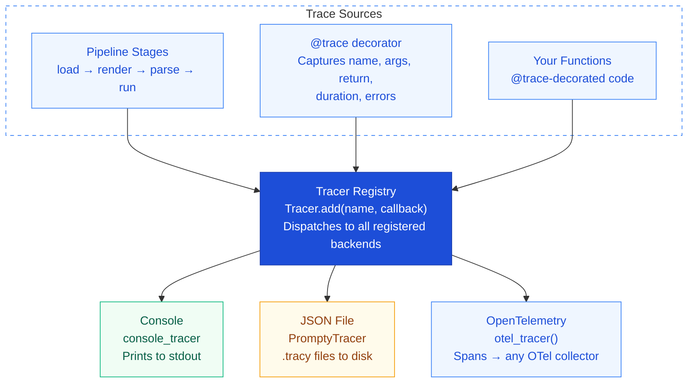

import { Aside, Tabs, TabItem } from '@astrojs/starlight/components';

## Overview

Every pipeline call in Prompty is **automatically traced**. The tracing system
uses a pluggable backend architecture — register as many trace consumers as you
need. Traces capture the full lifecycle of a prompt: loading, rendering,
parsing, execution, and processing.

Out of the box, tracing is a **zero-overhead no-op**. It only becomes active
when you register one or more backends.

---

## Architecture



---

## Tracer Registry

Register trace backends at application startup. Each backend is a callback
function that receives structured trace data. You can register as many as you
like — every trace event is dispatched to **all** registered backends.

<Tabs>
  <TabItem label="Python">
    ```python
    from prompty import Tracer, PromptyTracer

    # JSON file tracer — writes structured traces to disk
    Tracer.add("json", PromptyTracer("./traces").tracer)

    # Console tracer — prints to stdout
    from prompty.tracing.tracer import console_tracer
    Tracer.add("console", console_tracer)
    ```
  </TabItem>
  <TabItem label="TypeScript">
    ```typescript
    import { Tracer, PromptyTracer, consoleTracer } from "@prompty/core";

    // JSON file tracer — writes structured traces to disk
    const promptyTracer = new PromptyTracer("./traces");
    Tracer.add("json", promptyTracer.tracer);

    // Console tracer — prints to stdout
    Tracer.add("console", consoleTracer);
    ```
  </TabItem>
</Tabs>

<Aside type="tip">
  Register backends **once** at startup (e.g. in your `main()` or app factory).
  Every subsequent pipeline call will automatically dispatch to all registered
  backends.
</Aside>

---

## The `@trace` Decorator

Wrap any function to include it in the trace tree. When a traced function calls
other traced functions (including Prompty's built-in pipeline), they appear as
**nested child spans**.

<Tabs>
  <TabItem label="Python">
    ```python
    from prompty import trace

    @trace
    def my_business_logic(query: str) -> str:
        result = prompty.execute("search.prompty", inputs={"q": query})
        return process(result)
    ```
  </TabItem>
  <TabItem label="TypeScript">
    ```typescript
    import { trace, execute } from "@prompty/core";

    async function myBusinessLogic(query: string): Promise<string> {
      const result = await execute("search.prompty", { inputs: { q: query } });
      return process(result);
    }

    const tracedLogic = trace(myBusinessLogic, "myBusinessLogic");
    ```
  </TabItem>
</Tabs>

The decorator automatically captures:

| Field | Description |
|---|---|
| **Function name** | The `__name__` of the decorated function |
| **Arguments** | All positional and keyword arguments |
| **Return value** | The function's return value |
| **Duration** | Wall-clock time from entry to exit |
| **Exceptions** | Any exception raised (re-raised after tracing) |

<Aside type="note">
  `@trace` works on both sync and async functions. For async functions, it
  correctly awaits the coroutine and traces the full async execution.
</Aside>

---

## PromptyTracer

The built-in **JSON file backend** for local development and debugging. It writes
one `.tracy` file per top-level trace to the specified output directory.

<Tabs>
  <TabItem label="Python">
    ```python
    from prompty import Tracer, PromptyTracer

    tracer = PromptyTracer("./traces")
    Tracer.add("json", tracer.tracer)
    ```
  </TabItem>
  <TabItem label="TypeScript">
    ```typescript
    import { Tracer, PromptyTracer } from "@prompty/core";

    const tracer = new PromptyTracer("./traces");
    Tracer.add("json", tracer.tracer);
    ```
  </TabItem>
</Tabs>

Each `.tracy` file contains structured JSON with the full trace tree — every
span, its duration, inputs, outputs, and any nested child spans. These files
are human-readable and easy to inspect or post-process.

<Aside type="tip">
  The `./traces` directory is created automatically if it doesn't exist. Add it
  to your `.gitignore` to keep trace files out of version control.
</Aside>

---

## OpenTelemetry Integration

For **production observability**, Prompty integrates with
[OpenTelemetry](https://opentelemetry.io/). Each trace becomes a set of OTel
spans, compatible with any collector — Azure Monitor, Jaeger, Zipkin, Datadog,
and more.

<Tabs>
  <TabItem label="Python">
    ```python
    from prompty.tracing.otel import otel_tracer
    from prompty import Tracer

    Tracer.add("otel", otel_tracer())
    ```
  </TabItem>
  <TabItem label="TypeScript">
    ```typescript
    import { Tracer } from "@prompty/core";
    import { otelTracer } from "@prompty/core/tracing/otel";

    Tracer.add("otel", otelTracer());
    ```
  </TabItem>
</Tabs>

<Aside type="caution">
  Requires the OpenTelemetry package:
  <Tabs>
    <TabItem label="Python">
      ```bash
      pip install prompty[otel]
      ```
    </TabItem>
    <TabItem label="TypeScript">
      ```bash
      npm install @opentelemetry/api
      ```
    </TabItem>
  </Tabs>
</Aside>

### Combining Backends

You can register **multiple backends simultaneously** — for example, OTel for
production monitoring and console output for local debugging:

<Tabs>
  <TabItem label="Python">
    ```python
    from prompty import Tracer, PromptyTracer
    from prompty.tracing.tracer import console_tracer
    from prompty.tracing.otel import otel_tracer

    # Production: send to OTel collector
    Tracer.add("otel", otel_tracer())

    # Development: also log to console
    Tracer.add("console", console_tracer)

    # Debugging: also write .tracy files
    Tracer.add("json", PromptyTracer("./traces").tracer)
    ```
  </TabItem>
  <TabItem label="TypeScript">
    ```typescript
    import { Tracer, PromptyTracer, consoleTracer } from "@prompty/core";
    import { otelTracer } from "@prompty/core/tracing/otel";

    // Production: send to OTel collector
    Tracer.add("otel", otelTracer());

    // Development: also log to console
    Tracer.add("console", consoleTracer);

    // Debugging: also write .tracy files
    Tracer.add("json", new PromptyTracer("./traces").tracer);
    ```
  </TabItem>
</Tabs>

---

## What Gets Traced

Prompty **automatically traces every pipeline stage**. You don't need to add
`@trace` to use built-in tracing — it's wired into the core pipeline.

| Pipeline Stage | What's Captured |
|---|---|
| **load** | File path, frontmatter parsing, legacy migration warnings |
| **render** | Template engine, input variables, rendered output |
| **parse** | Parser type, role markers found, message count |
| **prepare** | Combined render + parse, thread expansion |
| **execute** | Model, provider, API type, request payload |
| **run** | LLM call — token usage, latency, full response |
| **process** | Response extraction, content type, tool calls |

### LLM Call Details

When the executor calls the LLM, the trace includes:

- **Model identifier** — which model was called
- **Token usage** — prompt tokens, completion tokens, total
- **Latency** — round-trip time for the API call
- **Response** — the full model response (content, tool calls, finish reason)
- **Streaming** — if streaming, traces flush when the stream is fully consumed

---

## TypeScript Support

The Prompty TypeScript runtime (`@prompty/core`) includes the same tracing
capabilities with a pluggable backend architecture. All the patterns shown
above — `Tracer.add()`, `trace()`, `PromptyTracer`, and `consoleTracer` —
are available as TypeScript imports as shown in the code examples.

---

## Disabling Tracing

Tracing is **disabled by default**. If you never call `Tracer.add()`, the
tracing system is effectively a no-op with **zero overhead** — the decorator
and pipeline hooks short-circuit immediately when no backends are registered.

To disable tracing after it's been enabled, simply don't register any backends
on the next application restart. There is no explicit "disable" API because the
default state is already off.

<Tabs>
  <TabItem label="Python">
    ```python
    # No Tracer.add() calls → tracing is a no-op
    from prompty import load, run

    agent = load("my-prompt.prompty")
    result = run(agent, inputs={"query": "hello"})
    # No traces produced — zero overhead
    ```
  </TabItem>
  <TabItem label="TypeScript">
    ```typescript
    // No Tracer.add() calls → tracing is a no-op
    import { load, run } from "@prompty/core";
    import "@prompty/openai";

    const agent = load("my-prompt.prompty");
    const result = await run(agent, [{ role: "user", content: "hello" }]);
    // No traces produced — zero overhead
    ```
  </TabItem>
</Tabs>
