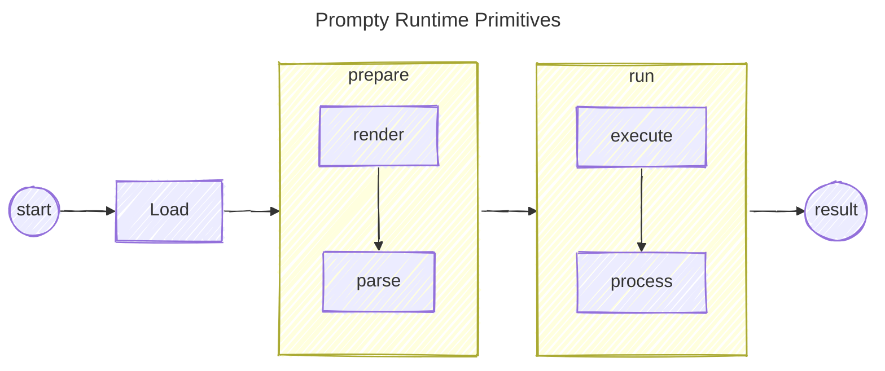

Having a common core runtime that can load, prepare, and run agents is essential to maximizing
interoperability. The runtime is responsible for loading the agent definition, preparing the
agent for execution, and executing the agent.

The runtime is broken down into three sections - Load, Prepare, and Run. The following
diagram illustrates the runtime:

### Load
The load section is responsible for loading the agent definition. It effectively loads the 
agent definition into an object form that can be used by the either the runtime or the calling
provider.

### Prepare
The prepare section is responsible for preparing the agent input for execution. This includes
rendering the template and parsing the text prompt. The prepare section is broken down into two
sections:
- `render`: The render section is responsible for rendering the template. This includes
  replacing the placeholders in the template with the values from the inputs and tools sections.
  The render section is typically implemented using a template engine, such as Mustache or Jinja2.
- `parse`: The parse section is responsible for parsing the text prompt. This includes
  converting the text prompt into a compatible form that can be sent to the model. The parse
  section is typically implemented using a parser, such as Prompty.

### Run
The run section is responsible for executing the agent. This includes sending the rendered and
parsed text prompt to the model, and processing the response from the model. The run section is
broken down into two sections:
- `execute`: The execute section is responsible for executing the agent. This includes sending
  the rendered and parsed text prompt to the model, and processing the response from the model.
  The execute section is typically implemented using a model execution engine, such as Azure
  OpenAI or Anthropic.
- `process`: The process section is responsible for processing the response from the model. This
  includes converting the response from the model into a compatible form that can be returned to
  the caller. The process section is typically implemented using a response processor, such as
  Prompty.

### Tracing
The runtime should provide and agnostic mechanism for tracing the execution of the agent. This
includes tracing the execution of the agent, the rendering of the template, the parsing of the
text prompt, and the processing of the response from the model.

The current Python implementation uses a hook-based approach whereby users can inject their own
tracing logic into the runtime. This allows users to trace the execution of the agent in whatever
way they see fit. The current implementation provides a set of hooks that can be used to trace
to both the console as well as to a file. In general, it is recommended to inject an 
[OpenTelemetry](https://opentelemetry.io/) based tracing solution to trace the execution
of the agent in production.