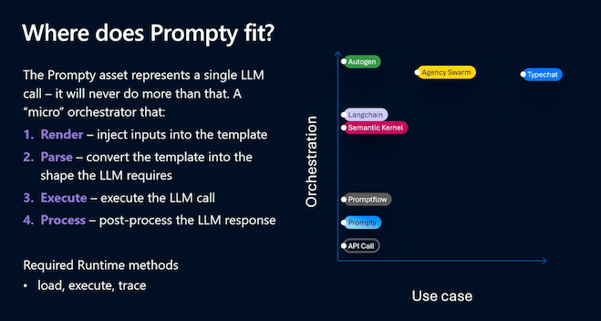

_In this section, we cover the core building blocks of Prompty (specification, tooling, and runtime) and walk you through the developer flow and mindset for going from "prompt" to "prototype"_.


## Prompty Components

The Prompty implementation consists of three core components - the _specification_ (file format), the _tooling_ (developer experience) and the _runtime_ (executable code). Let's review these briefly.


### The Prompty Specification

The [Prompty specification](https://github.com/microsoft/prompty/blob/main/Prompty.yaml) defines the core `.prompty` asset file format. We'll look at this in more detail in the [Prompty File Spec](/specification/page/) section of the documentation. For now, click to expand the section below to see a _basic.prompty_ sample and get an intuitive sense for what an asset file looks like.

<details>
<summary> **Learn More**: The `basic.prompty` asset file </summary>

  ```markdown
  ---
  name: Basic Prompt
  description: A basic prompt that uses the GPT-3 chat API to answer questions
  authors:
    - sethjuarez
    - jietong
  model:
    api: chat
    configuration:
      api_version: 2023-12-01-preview
      azure_endpoint: ${env:AZURE_OPENAI_ENDPOINT}
      azure_deployment: ${env:AZURE_OPENAI_DEPLOYMENT:gpt-35-turbo}
  sample:
    firstName: Jane
    lastName: Doe
    question: What is the meaning of life?
  ---
  system:
  You are an AI assistant who helps people find information.
  As the assistant, you answer questions briefly, succinctly, 
  and in a personable manner using markdown and even add some personal flair with appropriate emojis.

  # Customer
  You are helping {{firstName}} {{lastName}} to find answers to their questions.
  Use their name to address them in your responses.

  user:
  {{question}}
  ```

</details>

### The Prompty Tooling

The [Prompty Visual Studio Code Extension](https://marketplace.visualstudio.com/items?itemName=ms-toolsai.prompty) helps you create, manage, and execute, your `.prompty` assets - effectively giving you a _playground_ right in your editor, to streamline your prompt engineering workflow and speed up your prototype iterations. We'll get hands-on experience with this in the Tutorials section. For now, click to expand the section and get an intutive sense for how this enhances your developer experience.

<details>
<summary> **Learn More**: The Prompty Visual Studio Code Extension </summary>

- [Install the extension](https://marketplace.visualstudio.com/items?itemName=ms-toolsai.prompty) in your Visual Studio Code environment to get the following features out-of-the-box:
- Create a default `basic.prompty` starter asset - then configure models and customize content.
- Create the "pre-configured" starter assets for [GitHub Marketplace Models](https://github.com/marketplace/models) in _serverless_ mode.
- Create "starter code" from the asset for popular frameworks (e.g., LangChain)
- Use the _prompty_ commandline tool to execute a `.prompty` asset and "chat" with your model.
- Use _settings_ to create _named_ model configurations for reuse
- Use toolbar icon to view and switch quickly between named configurations
- View the "runs" history, and drill down into a run with a built-in trace viewer.

</details>

### The Prompty Runtime

The Prompty Runtime helps you make the transition from _static asset_ (`.prompty` file) to _executable code_ (using a preferred language and framework) that you can test interactively from the commandline, and integrate seamlessly into end-to-end development workflows for automation. We'll have a dedicated documentation on this **soon**. In the meantime, click to expand the section below to learn about **supported runtimes** today, and check back for updates on new runtime releases.

<details>
<summary> **Learn More**: Available Prompty Runtimes </summary>

Core runtimes provide the base package needed to run the Prompty asset with code. Prompty currently has two core runtimes, with more support coming.
* [Prompty Core (python)](https://pypi.org/project/prompty/) → Available _in preview_. 
* Prompty Core (csharp) → In _active development_.

Enhanced runtimes add support for orchestration frameworks, enabling complex workflows with Prompty assets:
* [Prompt flow](https://microsoft.github.io/promptflow/) → Python core
* [LangChain (python)](https://pypi.org/project/langchain-prompty/) → Python core (_experimental_) 
* [Semantic Kernel](https://learn.microsoft.com/semantic-kernel/) → C# core

</details>


## Developer Workflow

Prompty is ideal for rapid prototyping and iteration of a new generative AI application, using rich developer tooling and a local development runtime. It fits best into the _ideation_ and _evaluation_ phases of the GenAIOps application lifecycle as shown:

1. **Start** by creating & testing a simple prompt in VS Code
2. **Develop** by iterating config & content, use tracing to debug
3. **Evaluate** prompts with AI assistance, saved locally or to cloud


## Developer Mindset

As an AI application developer, you are likely already using a number of tools and frameworks to enhance your developer experience. So, where does Prompty fit into you developer toolchain? 

Think of it as a **micro-orchestrator focused on a single LLM invocation** putting it at a step above the basic _API call_ and positioned to support more complex orchestration frameworks above it. With Prompty, you can:
 - _configure_ the right model for that specific invocation
 - _engineer_ the prompt (system, user, context, instructions) for that request
 - _shape_ the data used to "render" the template on execution by the runtime



---
[Want to Contribute To the Project?](/contributing/) - _Updated Guidance Coming Soon_.
