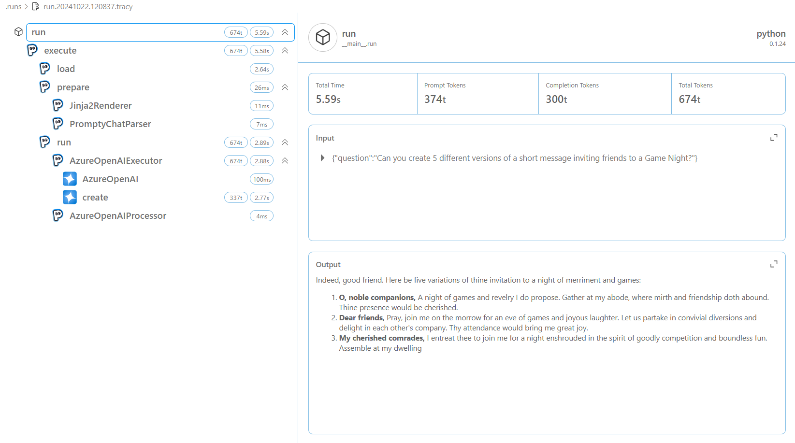
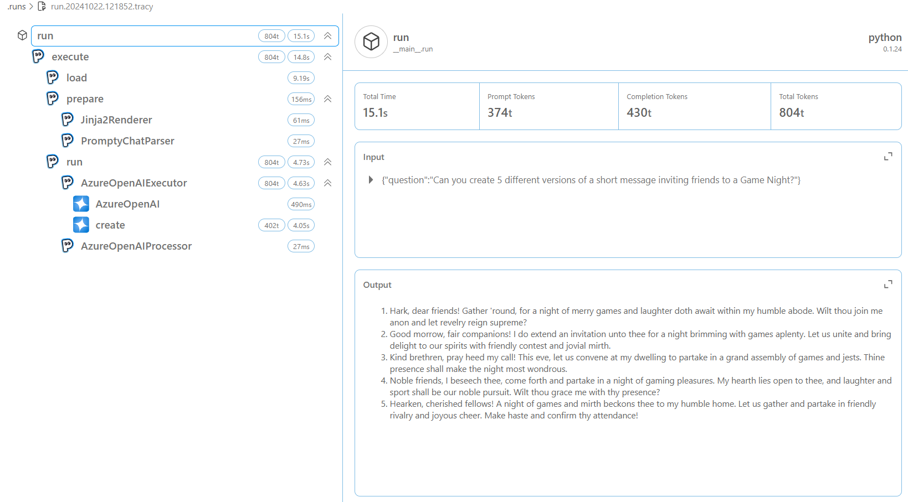
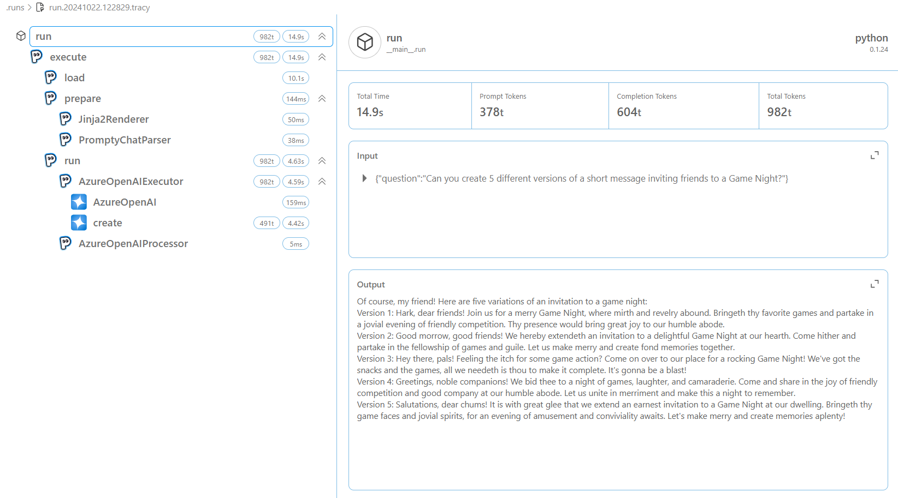

_In the last section, we converted our Prompty asset into code and successfully executed the application. In this section, we will cover how we can use Observability in Prompty to debug our application._


## 1. What we will cover

For observability in Prompty, we will use the tracer to visualize and debug the execution of the Prompty asset through the following steps:

- Understand observability in Prompty
- Build and debug a Prompty asset
- Understand how observability works in your code
- Analyze the trace output to debug and fix the bug


## 2. Understanding Observability in Prompty

Observability refers to the ability to monitor and understand the behavior of a system based on the data it produces, such as logs, metrics, and traces.. It is important as it provides you with insights on your LLM workflows and provides a way to debug your prompt inputs and outputs. 

In Prompty, you can easily trace and visualize flow, which helps you to understand and debug your code using the built-in tracer. Additionally, you can create your own tracer by adding your own hook. By default, Prompty has two traces built-in:

- **Console Tracer**: This tracer logs the output to the console.
- **Prompty Tracer**: This tracer logs the output to a JSON file.


## 3. Modify our Prompty
In our `shakespeare.prompty` asset we will update the prompt to request for different variations of the same message. The new prompt will be: `"Can you create 5 different versions of a short message inviting friends to a Game Night?"`. Additionally, change the `max_tokens:` value from `3000` to `150`.

Head over to the `shakespeare.py` file as well and update the question to: `"Can you create 5 different versions of a short message inviting friends to a Game Night?"`.


<details>
<summary>☑ **Function that executes the Prompty asset** (click to expand)</summary>
```markdown
---
name: Shakespearean Writing Prompty
description: A prompt that answers questions in Shakespearean style using Cohere Command-R model from GitHub Marketplace.
authors:
  - Bethany Jepchumba
model:
  api: chat
  configuration:
    type: azure_openai
    azure_endpoint: ${env:AZURE_OPENAI_ENDPOINT}
    azure_deployment: gpt-4o
  parameters:
    max_tokens: 150
sample:
  question: Can you create 5 different versions of a short message inviting friends to a Game Night?
---

system:
You are a Shakespearean writing assistant who speaks in a` Shakespearean style. You help people come up with creative ideas and content like stories, poems, and songs that use Shakespearean style of writing style, including words like "thou" and "hath”.
Here are some example of Shakespeare's style:
- Romeo, Romeo! Wherefore art thou Romeo?
- Love looks not with the eyes, but with the mind; and therefore is winged Cupid painted blind.
- Shall I compare thee to a summer's day? Thou art more lovely and more temperate.

example:
user: Please write a short text turning down an invitation to dinner.
assistant: Dearest,
  Regretfully, I must decline thy invitation.
  Prior engagements call me hence. Apologies.

user:
{{question}}
```
</details>


## 4. Adding observability to your code
To add a tracer, we have the following in our previously generated code snippet:

```python
from prompty.tracer import trace, Tracer, console_tracer, PromptyTracer

Tracer.add("console", console_tracer)
json_tracer = PromptyTracer()
Tracer.add("PromptyTracer", json_tracer.tracer)

@trace
def run(    
      question: any
) -> str:

  # execute the prompty file
  result = prompty.execute(
    "shakespeare.prompty", 
    inputs={
      "question": question
    }
  )
```

- **`Tracer.add("console", console_tracer)`**: logs tracing information to the console, useful for real-time debugging.
- **`json_tracer = PromptyTracer()`**: Creates an instance of the PromptyTracer class, which is a custom tracer.
- **`Tracer.add("PromptyTracer", json_tracer.tracer)`**: logs tracing in a `.tracy` JSON file for more detailed inspection after runs, providing you with an interactive UI.
- **`@trace`**: Decorator that traces the execution of the run function.


## 5: Analyzing and debugging the trace output

The output from the tracer is displayed in the console and in a `.tracy` file. A new `.tracy` file is created in a new `.runs` folder. 

The trace output is divided into three: _load, prepare_ and _run_. Load refers to the loading of the Prompty asset, prepare refers to the preparation of the Prompty asset, and run refers to the execution of the Prompty asset. Below is a sample of the trace output, showing the inputs, outputs, and metrics, such as execution time and token count:

> **Note:** it may take a while for the trace output to appear, and you may need to click several runs before seeing the full trace.




From the trace output, you can see the inputs, outputs and metrics such as time to execute the prompt and tokens. This information can be used to debug and fix any issues in your code. For example, we can see output has been truncated and the `Completion Tokens` count is less than 1000, which might not be sufficent for the prompt to generate different outputs. We can increase the `max_tokens` in our Prompty to 1000 to generate more tokens. Once done, run the code again and confirm you get 5 examples of the short message inviting friends to a Game Night.



You can continue experimenting with different parameters such as `temperature` and observe how it affects the model outputs.


## 6. Using observability for Model Selection

Another way to make the most of observability is in Model Selection. You can switch between models and observe their performance such as completion tokens, latency and accuracy for different tasks. For example, you can switch between the `gpt-4o` and `gpt-35-turbo` models and observe the performance of each model. You can also leverage on GitHub Models, Azure OpenAI and other models to observe the performance of each model. Below is a comparison of the trace output for the `gpt-4o` and `gpt-35-turbo` models:




From the output, you can see the difference in the completion tokens and the time taken to execute the prompt. This information can be used to select the best model for your use case.


## 7. Building a Custom Tracer in Prompty

In the guides section, we will provide a deep dive into [Observability in Prompty](/docs/guides/prompty-observability) and how you can create your own tracer.

---
[Want to Contribute To the Project?](/docs/contributing/) - _Updated Guidance Coming Soon_.
