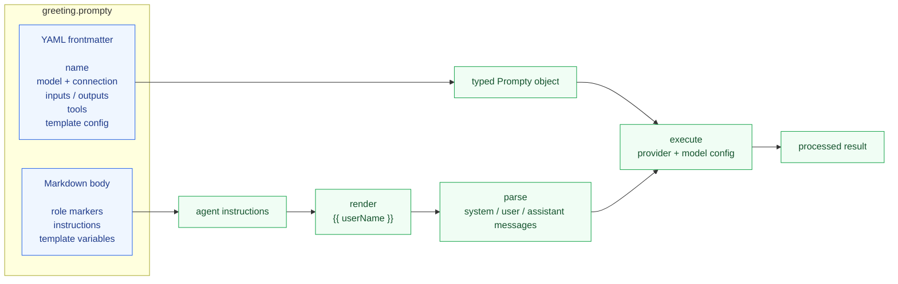

import { Aside, Code, Tabs, TabItem } from '@astrojs/starlight/components';
import pythonBasic from '../../../../docs-examples/python/examples/chat_basic.py?raw';
import tsBasic from '../../../../docs-examples/typescript/examples/chat-basic.ts?raw';
import csBasic from '../../../../docs-examples/csharp/Examples/ChatBasic.cs?raw';

## What is Prompty?

Prompty is a **markdown file format** for LLM prompts. A `.prompty` file
combines structured YAML frontmatter (model config, inputs, tools) with
a markdown body that becomes the prompt instructions. The runtime loads,
renders, parses, and executes these files.



The frontmatter is configuration. The body is the prompt. Prompty combines both:
frontmatter becomes a typed runtime object, and the markdown body becomes
rendered instructions that are parsed into chat messages.

## Installation

<Tabs>
  <TabItem label="Python">
    ```bash
    # Core + Jinja2 renderer + OpenAI provider
    uv pip install "prompty[jinja2,openai]"

    # With Microsoft Foundry support
    uv pip install "prompty[jinja2,foundry]"

    # With Anthropic support
    uv pip install "prompty[jinja2,anthropic]"

    # Everything
    uv pip install "prompty[all]"
    ```

    <Aside type="note">
      Prompty v2 requires **Python ≥ 3.11**. Use
      [uv](https://docs.astral.sh/uv/) for local environments and package
      management when working from source.
    </Aside>
  </TabItem>
  <TabItem label="TypeScript">
    ```bash
    # Core + OpenAI provider
    npm install @prompty/core @prompty/openai

    # With Microsoft Foundry support
    npm install @prompty/core @prompty/foundry

    # With Anthropic support
    npm install @prompty/core @prompty/anthropic
    ```
  </TabItem>
  <TabItem label="C#">
    ```bash
    dotnet add package Prompty.Core --prerelease
    dotnet add package Prompty.OpenAI --prerelease  # or Prompty.Foundry, Prompty.Anthropic
    ```

    <Aside type="note">
      C# packages are in **alpha preview**. Install with `--prerelease` to get the latest version.
    </Aside>
  </TabItem>
  <TabItem label="Rust">
    ```bash
    cargo add prompty prompty-openai
    ```
  </TabItem>
</Tabs>

## Choose a Provider

| Provider | Python extra | TypeScript package | C# package | Rust crate | Notes |
|---|---|---|---|---|---|
| OpenAI | `prompty[openai]` | `@prompty/openai` | `Prompty.OpenAI` | `prompty-openai` | Direct OpenAI and OpenAI-compatible endpoints. |
| Microsoft Foundry | `prompty[foundry]` | `@prompty/foundry` | `Prompty.Foundry` | `prompty-foundry` | Foundry/Azure OpenAI deployments; `azure` remains a deprecated alias. |
| Anthropic | `prompty[anthropic]` | `@prompty/anthropic` | `Prompty.Anthropic` | `prompty-anthropic` | Claude via Anthropic Messages API. |

If you are not sure which `model.id` or deployment to use, see
[Discover Available Models](/how-to/model-discovery/).

## Write Your First `.prompty` File

Create a file called `greeting.prompty`:

```yaml
---
name: greeting
description: A friendly greeting prompt
model:
  id: gpt-4o-mini
  provider: openai
  connection:
    kind: key
    apiKey: ${env:OPENAI_API_KEY}
inputs:
  - name: userName
    kind: string
    default: World
---
system:
You are a friendly assistant who greets people warmly.

user:
Say hello to {{userName}} and ask how their day is going.
```

## Run It

<Tabs>
  <TabItem label="Python">
    ```python
    import prompty

    # All-in-one: load → render → parse → execute → process
    result = prompty.invoke(
        "greeting.prompty",
        inputs={"userName": "Jane"},
    )
    print(result)
    # "Hello Jane! 👋 How's your day going so far?"
    ```
  </TabItem>
  <TabItem label="TypeScript">
    ```typescript
    import { invoke } from "@prompty/core";
    import "@prompty/openai";

    const result = await invoke("greeting.prompty", {
      userName: "Jane",
    });
    console.log(result);
    // "Hello Jane! 👋 How's your day going so far?"
    ```
  </TabItem>
  <TabItem label="C#">
    ```csharp
    using Prompty.Core;

    var result = await Pipeline.InvokeAsync("greeting.prompty", new() { ["userName"] = "Jane" });
    Console.WriteLine(result);
    // "Hello Jane! 👋 How's your day going so far?"
    ```
  </TabItem>
  <TabItem label="Rust">
    ```rust
    use prompty;
    use prompty_openai;
    use serde_json::json;

    // Register providers
    prompty::register_defaults();
    prompty_openai::register();

    // All-in-one: load → render → parse → execute → process
    let result = prompty::invoke_from_path(
        "greeting.prompty",
        Some(&json!({ "userName": "Jane" })),
    ).await?;
    println!("{result}");
    // "Hello Jane! 👋 How's your day going so far?"
    ```
  </TabItem>
</Tabs>

## Step-by-Step Pipeline

For more control, use the pipeline stages individually:

<Tabs>
  <TabItem label="Python">
    ```python
    import prompty

    # 1. Load the .prompty file → typed Prompty object
    agent = prompty.load("greeting.prompty")

    # 2. Render template + parse → list[Message]
    messages = prompty.prepare(agent, inputs={"userName": "Jane"})

    # 3. Call the LLM + process → clean result
    result = prompty.run(agent, messages)
    ```
  </TabItem>
  <TabItem label="TypeScript">
    ```typescript
    import { load, prepare, run } from "@prompty/core";
    import "@prompty/openai";

    const agent = await load("greeting.prompty");
    const messages = await prepare(agent, { userName: "Jane" });
    const result = await run(agent, messages);
    ```
  </TabItem>
  <TabItem label="C#">
    ```csharp
    using Prompty.Core;

    // 1. Load the .prompty file → Prompty
    var agent = PromptyLoader.Load("greeting.prompty");

    // 2. Render template + parse → messages
    var rendered = await Pipeline.RenderAsync(agent, new() { ["userName"] = "Jane" });
    var messages = await Pipeline.ParseAsync(agent, rendered);

    // 3. Call the LLM + process → clean result
    var response = await Pipeline.ExecuteAsync(agent, messages);
    var result = await Pipeline.ProcessAsync(agent, response);
    ```
  </TabItem>
  <TabItem label="Rust">
    ```rust
    use prompty;
    use prompty_openai;
    use serde_json::json;

    prompty::register_defaults();
    prompty_openai::register();

    // 1. Load the .prompty file → typed agent
    let agent = prompty::load("greeting.prompty")?;

    // 2. Render template + parse → messages
    let messages = prompty::prepare(
        &agent, Some(&json!({ "userName": "Jane" }))
    ).await?;

    // 3. Call the LLM + process → clean result
    let result = prompty::run(&agent, &messages).await?;
    ```
  </TabItem>
</Tabs>

## Environment Variables

Use `${env:VAR_NAME}` in frontmatter to reference environment variables.
Create a `.env` file in your project root:

```bash
OPENAI_API_KEY=sk-your-key-here
```

Prompty automatically loads `.env` files.

## Complete Example

Here's a full, tested example you can copy and run:

<Tabs>
  <TabItem label="Python">
    <Code code={pythonBasic} lang="python" title="chat_basic.py" />
  </TabItem>
  <TabItem label="TypeScript">
    <Code code={tsBasic} lang="typescript" title="chat-basic.ts" />
  </TabItem>
  <TabItem label="C#">
    <Code code={csBasic} lang="csharp" title="ChatBasic.cs" />
  </TabItem>
  <TabItem label="Rust">
    ```rust
    // chat_basic.rs
    use prompty;
    use prompty_openai;
    use serde_json::json;

    #[tokio::main]
    async fn main() -> Result<(), Box<dyn std::error::Error>> {
        prompty::register_defaults();
        prompty_openai::register();

        let result = prompty::invoke_from_path(
            "greeting.prompty",
            Some(&json!({ "userName": "Jane" })),
        ).await?;

        println!("{result}");
        Ok(())
    }
    ```
  </TabItem>
</Tabs>

## Next Steps

- [The .prompty File Format](/core-concepts/file-format/) — understand the anatomy of a `.prompty` file
- [Pipeline Architecture](/core-concepts/pipeline/) — how render → parse → execute → process works
- [Schema Reference](/reference/) — all available frontmatter properties
- [How-To Guides](/how-to/openai/) — practical recipes for common tasks
- [Tutorials](/tutorials/) — hands-on walkthroughs from chat to production
- [Why Prompty?](/welcome/) — design philosophy and motivation
