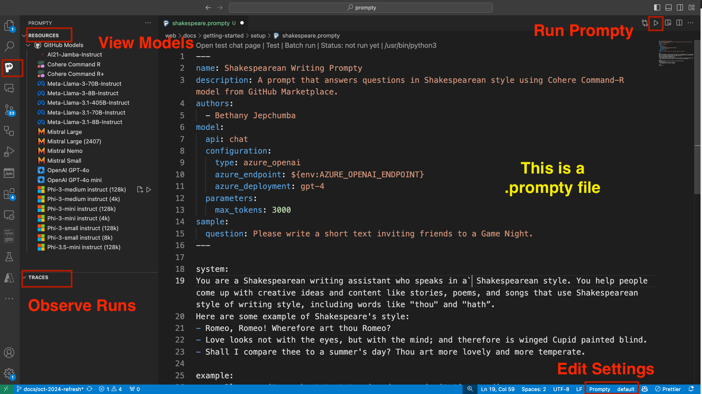

_In this section, we learn to set up our development environment and get ready to create and run our first Prompty asset_.

## Pre-requisites

To create your first Prompty (using the VS Code Extension), you will need:

- A GitHub account (you can [create one for free](https://github.com/signup))
- Access to the [GitHub Models Marketplace](https://github.com/marketplace/models)
- A computer with the Visual Studio Code IDE installed.

## Developer Tools

The Prompty project has three tools to support your prompt engineering and rapid prototyping needs:

- The `Prompty` Visual Studio Code Extension 
- The `prompty` CLI - for command-line interactions
- The `prompty` SDK - for code-first interactions in Python

Let's start with the Visual Studio Code extension.

## Install Prompty Extension

The easiest way to get started with Prompty, is to use the Visual Studio Code Extension. Launch Visual Studio Code, then install the extension using one of these two options:

1. Visit the [Visual Studio Code Marketplace](https://marketplace.visualstudio.com/items?itemName=ms-toolsai.prompty) in the browser. Click to install, and you should see the install complete in your IDE.
1. Click the Extensions explorer icon in the Visual Studio Code sidebar (left) and search for "Prompty". Install directly into VS Code.

## Explore Prompty Extension

Once installed, you should see a stylized "P" (resembling the Prompty logo) in the VS Code sidebar, as seen in the figure below (left). Click the extension and you should see the _Prompty_ panel slide out at left. 

With this, you see four Prompty-related features in the frame:

1. **Resources** - containing a list of serverless models from the GitHub Models Marketplace.
1. **Traces** - that enable observability of your Prompty execution with trace logs for runs.
1. **Run Prompty** - the "play" icon is visible when you are in a `.prompty` files.
1. **Edit Settings** - shows the "Prompty default" tab on toolbar that links to settings.
1. **Prompty Asset** - the editor shows a `.prompty` file, giving you a first look at this asset.

In the next section, we'll create our first prompty and make use of the identified features to run it and observe the results.

---
[Want to Contribute To the Project?](/docs/contributing/) - _Updated Guidance Coming Soon_.
