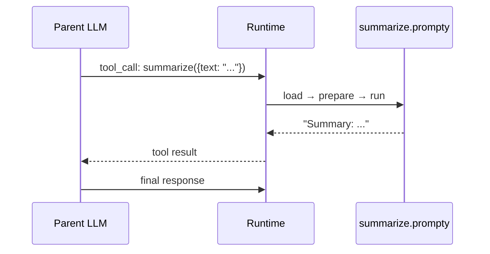

import { Aside, Tabs, TabItem } from '@astrojs/starlight/components';

## What is PromptyTool?

A `kind: prompty` tool lets one `.prompty` file **call another** as a tool.
The outer agent invokes the inner prompt as part of its tool-calling loop —
the LLM decides *when* to use it, and the runtime handles loading, rendering,
and executing the child prompt automatically.

```yaml
tools:
  - name: summarize
    kind: prompty
    path: ./summarize.prompty
    mode: single
```

The LLM sees this as a regular function call — it doesn't know it's backed by
another `.prompty` file.

---

## Example: Summarizer + Classifier

Three files work together — `summarize.prompty` and `classify.prompty` are
standalone prompts, and `orchestrator.prompty` wires them as tools.

### summarize.prompty

```yaml
---
name: summarize
model:
  id: gpt-4o-mini
  apiType: chat
inputs:
  - name: text
    kind: string
---
system:
Summarize the following text in 1-2 sentences.

user:
{{text}}
```

### classify.prompty

```yaml
---
name: classify
model:
  id: gpt-4o-mini
  apiType: chat
inputs:
  - name: text
    kind: string
---
system:
Classify the text into one category: technology, business, science, sports, or other.
Return only the category name.

user:
{{text}}
```

### orchestrator.prompty

```yaml
---
name: orchestrator
model:
  id: gpt-4o
  apiType: chat
tools:
  - name: summarize
    kind: prompty
    description: Summarize a piece of text
    path: ./summarize.prompty
    mode: single
    parameters:
      - name: text
        kind: string
        description: The text to summarize
  - name: classify
    kind: prompty
    description: Classify text into a category
    path: ./classify.prompty
    mode: single
    parameters:
      - name: text
        kind: string
        description: The text to classify
inputs:
  - name: article
    kind: string
---
system:
You are an assistant that analyzes articles.
Given an article, summarize it and classify it into a category.
Use the available tools.

user:
{{article}}
```

### Running the orchestrator

<Tabs>
  <TabItem label="Python">
    ```python
    from prompty import load, turn

    agent = load("orchestrator.prompty")
    result = turn(agent, {"article": "OpenAI announced GPT-5 today..."})
    print(result)
    ```
  </TabItem>
  <TabItem label="TypeScript">
    ```typescript
    import { load, turn } from "@prompty/core";

    const agent = await load("orchestrator.prompty");
    const result = await turn(agent, { article: "OpenAI announced GPT-5 today..." });
    console.log(result);
    ```
  </TabItem>
  <TabItem label="C#">
    ```csharp
    var agent = PromptyLoader.Load("orchestrator.prompty");
    var result = await Pipeline.TurnAsync(
        agent, new { article = "OpenAI announced GPT-5 today..." });
    Console.WriteLine(result);
    ```
  </TabItem>
  <TabItem label="Rust">
    ```rust
    // In Rust, PromptyTool is a registered tool kind.
    // Define it in the .prompty frontmatter:
    //   tools:
    //     - name: summarize
    //       kind: prompty
    //       path: ./summarize.prompty
    // The pipeline automatically loads and invokes the referenced .prompty file.

    use serde_json::json;
    use prompty::TurnOptions;

    #[tokio::main]
    async fn main() -> Result<(), Box<dyn std::error::Error>> {
        prompty::register_defaults();
        prompty_openai::register();

        let agent = prompty::load("orchestrator.prompty")?;
        let result = prompty::turn_from_path(
            "orchestrator.prompty",
            Some(&json!({ "article": "OpenAI announced GPT-5 today..." })),
            Some(TurnOptions::default()),
        ).await?;
        println!("{result}");
        Ok(())
    }
    ```
  </TabItem>
</Tabs>

No tool functions to register — the runtime resolves `kind: prompty` tools automatically
by loading the child `.prompty` file and executing it.

---

## How It Works

When the agent loop encounters a tool call for a `kind: prompty` tool, the
`PromptyToolHandler` runs this sequence:

1. **Resolve path** — `path` is resolved relative to the parent `.prompty` file's directory
2. **Load** — the child `.prompty` is loaded via `load()`
3. **Execute** — in `single` mode: `prepare()` + `run()`. In `agentic` mode: `turn()` (the child runs its own agent loop)
4. **Return** — the result string is sent back to the parent LLM as the tool response



<Aside type="tip">
  Set `mode: agentic` when the child prompt itself has tools and needs its own
  agent loop. Use `mode: single` (the default) for straightforward prompts.
</Aside>

---

## Bindings

Bindings map the **parent's inputs** to the **child tool's parameters** — so values
flow automatically without the LLM needing to pass them explicitly.

```yaml
tools:
  - name: summarize
    kind: prompty
    path: ./summarize.prompty
    parameters:
      - name: text
        kind: string
        description: The text to summarize
    bindings:
      context:
        input: document
```

Here, the parent's `document` input is automatically passed as the child's
`context` parameter. The `context` parameter is stripped from the wire schema
sent to the LLM, so the model only sees `text` as a callable parameter.

This is useful when the child prompt needs context (like a system config or
user profile) that the orchestrator already has — the LLM doesn't need to
know about it.

<Aside>
  Bindings work on any tool type, not just PromptyTool. See the
  [Tools](/core-concepts/tools/#tool-bindings) reference for the full binding syntax.
</Aside>
