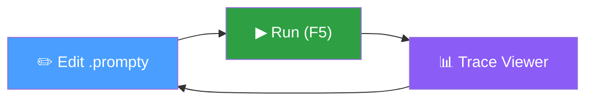
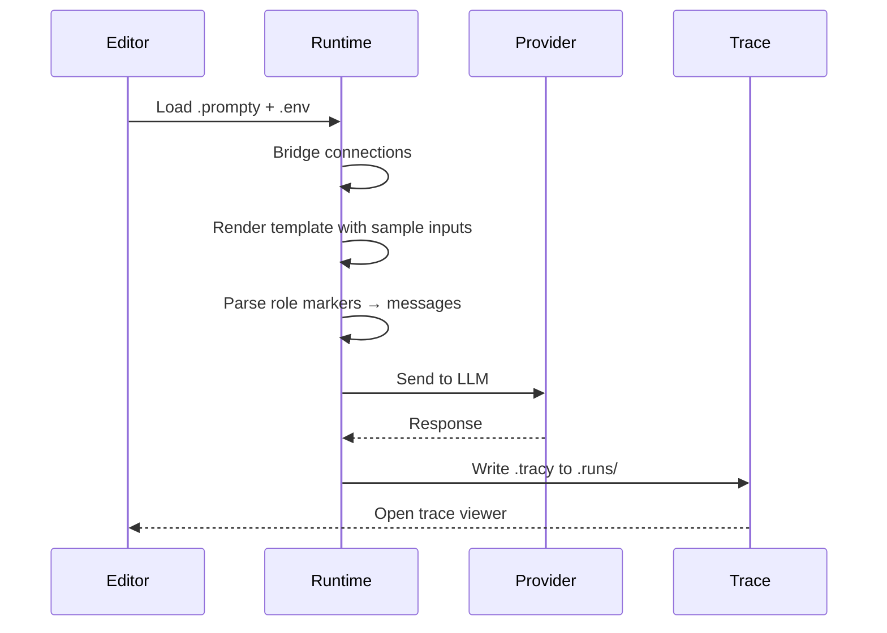

import { Aside, Tabs, TabItem } from '@astrojs/starlight/components';

## Overview

The **Prompty VS Code extension** is the primary tool for authoring, running,
and debugging `.prompty` files. It includes a built-in TypeScript runtime — no
Python installation is required.

The core workflow is **edit → run → trace → iterate**:



1. **Edit** your prompt with syntax highlighting, autocomplete, and validation
2. **Run** it against a configured model connection with one keystroke
3. **Inspect** the execution trace — messages, tokens, timing, raw API response
4. **Iterate** — adjust the prompt and run again

### What's in the Extension

| Area | Capabilities |
|---|---|
| **Language support** | TextMate grammar, language server (validation, completion, hover, semantic tokens, document symbols) |
| **Connections** | Manage OpenAI, Anthropic, and Microsoft Foundry connections with secure secret storage |
| **Execution** | Run prompts, preview rendered output, interactive chat mode for thread-based prompts |
| **Traces** | `.tracy` file format with a full React-based trace viewer |
| **Extensibility** | API for other extensions to register providers, executors, and processors |

---

## Installation

Install from the VS Code Marketplace:

1. Open VS Code
2. Press `Ctrl+Shift+X` (or `Cmd+Shift+X` on macOS) to open Extensions
3. Search for **Prompty**
4. Click **Install** on the extension by **ms-toolsai**

Or install from the command line:

```bash
code --install-extension ms-toolsai.prompty
```

<Aside type="tip">
  The extension ID is `ms-toolsai.prompty`. You can also find it in the
  [Visual Studio Marketplace](https://marketplace.visualstudio.com/items?itemName=ms-toolsai.prompty).
</Aside>

After installation, the **Prompty icon** appears in the Activity Bar (left
sidebar). Click it to open the Prompty Explorer, which contains the
**Connections** and **Traces** panels. The **status bar** (bottom right) shows
your current default connection.

---

## Connection Setup

Connections define how the extension reaches an LLM provider. The extension
ships with built-in support for three providers:

| Provider | Auth Method | Model Discovery |
|---|---|---|
| **OpenAI** | API key | ✅ `models.list()` |
| **Anthropic** | API key | ✅ `GET /v1/models` |
| **Microsoft Foundry** | Azure AD (DefaultAzureCredential) | ✅ `GET /deployments` |

### How Connections are Stored

- **Profiles** are saved in your workspace at `.prompty/connections.json`
- **Secrets** (API keys) are stored in VS Code's built-in `SecretStorage` — they
  never appear in the JSON file

```json title=".prompty/connections.json"
{
  "version": 1,
  "connections": [
    {
      "id": "openai-a1b2c3",
      "name": "My OpenAI",
      "providerType": "openai",
      "authType": "key",
      "endpoint": "https://api.openai.com/v1",
      "model": "gpt-4o",
      "isDefault": true
    }
  ]
}
```

<Aside type="caution">
  Add `.prompty/` to your `.gitignore` if your `connections.json` contains
  endpoints or other values you don't want in source control. API keys are
  always safe — they're stored in VS Code's SecretStorage, not the JSON file.
</Aside>

### Adding a Connection

1. In the Prompty Explorer sidebar, click the **+** button on the **Connections** panel
   — or run **Prompty: Add Connection** from the Command Palette
2. Pick a provider from the QuickPick menu: **OpenAI**, **Anthropic**, or **Microsoft Foundry**
3. Fill in the fields (varies by provider — see below)
4. The connection is saved and you're offered to **test it immediately**

### Setting Up OpenAI

<Tabs>
<TabItem label="Wizard Steps">
| Step | Field | Required | Default |
|---|---|---|---|
| 1 | **Connection name** | ✅ | — |
| 2 | **API key** | ✅ | — |
| 3 | **Endpoint** | ❌ | `https://api.openai.com/v1` |
| 4 | **Model** | ❌ | `gpt-4o` |
</TabItem>
<TabItem label="Example">
```
Connection name: my-openai
API key: sk-...
Endpoint: (leave default)
Model: gpt-4o-mini
```
</TabItem>
</Tabs>

<Aside type="tip">
  After adding the connection, expand it in the sidebar to see the **Models**
  section. The extension calls `models.list()` to discover all available models
  on your account.
</Aside>

### Setting Up Anthropic

<Tabs>
<TabItem label="Wizard Steps">
| Step | Field | Required | Default |
|---|---|---|---|
| 1 | **Connection name** | ✅ | — |
| 2 | **API key** | ✅ | — |
| 3 | **Endpoint** | ❌ | `https://api.anthropic.com` |
| 4 | **Model** | ❌ | `claude-sonnet-4-6` |
</TabItem>
<TabItem label="Example">
```
Connection name: my-anthropic
API key: sk-ant-...
Endpoint: (leave default)
Model: claude-sonnet-4-6
```
</TabItem>
</Tabs>

### Setting Up Microsoft Foundry

Microsoft Foundry connections use **Azure AD authentication** instead of API
keys. The extension obtains a bearer token via
`DefaultAzureCredential`, so you must be logged in to Azure (e.g., via the
Azure CLI or the VS Code Azure Account extension).

<Tabs>
<TabItem label="Wizard Steps">
| Step | Field | Required | Default |
|---|---|---|---|
| 1 | **Connection name** | ✅ | — |
| 2 | **Project endpoint** | ✅ | — |
| 3 | **Foundry connection name** | ❌ | — |
| 4 | **Tenant ID** | ❌ | — |
</TabItem>
<TabItem label="Example">
```
Connection name: my-foundry
Project endpoint: https://my-project.services.ai.azure.com
Foundry connection name: (leave blank for default)
Tenant ID: (leave blank for default)
```
</TabItem>
</Tabs>

<Aside type="note">
  The project endpoint must start with `https://`. Model discovery calls
  `GET {endpoint}/deployments?api-version=v1` to list deployed models.
</Aside>

### Testing a Connection

Right-click any connection in the sidebar and select **Test Connection**, or
click the **plug icon** that appears inline. The extension runs a lightweight
check for each provider:

| Provider | What the test does | On success |
|---|---|---|
| **OpenAI** | Calls `models.list()` | Reports latency |
| **Anthropic** | Sends a minimal `messages` request | Reports HTTP 200 |
| **Foundry** | Authenticates with Azure AD, calls deployments endpoint | Reports deployment count and credential source |

### Setting a Default Connection

Right-click a connection and select **Set as Default**, or click the star icon.
The default connection is set **per provider type** — you can have one default
OpenAI connection and one default Anthropic connection simultaneously.

When you run a prompt:
1. If the `.prompty` frontmatter specifies a `model.connection`, that's used
2. Otherwise, the default connection for the matching provider type is used
3. If no provider-specific default exists, any available default is used

The status bar at the bottom right shows your current default:
`$(plug) My OpenAI` — click it to change the default.

### Model Discovery

For providers that support it, expand a connection in the sidebar to see a
**Models** section listing all available models. Click the **refresh** button to
re-fetch. The discovered model IDs can be used in your `.prompty` file's
`model.id` field, and the language server offers them as completions.

---

## Writing Prompts

### Language Support

The extension registers `.prompty` as a first-class language with rich editor
features:

**Syntax highlighting** via a TextMate grammar with embedded language support:
- **YAML frontmatter** between `---` delimiters
- **Jinja2 template syntax** — `{{ variables }}`, ``, `{# comments #}`
- **Role markers** — `system:`, `user:`, `assistant:`, `developer:`, `tool:`, `function:`
  are highlighted distinctly so conversation structure is visible at a glance

**Language server** providing real-time feedback:
- **Validation** — YAML syntax errors, frontmatter schema violations, and
  connection/provider validation are reported as diagnostics
- **Completions** — IntelliSense for frontmatter properties, enum values
  (`provider`, `apiType`, `connection.kind`, `format.kind`, `parser.kind`),
  model IDs from discovered models, and `{{ input }}` variable references in the body
- **Hover** — hover over `{{ variable }}` in the body to see its type, description,
  default, and example values from `inputSchema`; hover over enum values in
  frontmatter for quick documentation
- **Semantic tokens** — frontmatter delimiters, role names, template variables,
  `${env:...}` references, thread markers, and key-value pairs get semantic
  coloring beyond what the TextMate grammar provides
- **Document symbols** — the Outline panel shows frontmatter sections and role
  blocks for quick navigation

### Creating a New File

Use the Command Palette (`Ctrl+Shift+P`) and run **Prompty: New Prompty** to
scaffold a new `.prompty` file. You can also right-click in the Explorer sidebar
and select **New Prompty**.

Or create any file with a `.prompty` extension — the extension activates
automatically when it detects `.prompty` files in the workspace.

### File Structure

A `.prompty` file has two parts:

```prompty
---
# YAML frontmatter — model, inputs, tools, template config
name: my-prompt
model:
  id: gpt-4o
inputSchema:
  properties:
    name:
      kind: string
      default: World
template:
  format:
    kind: jinja2
  parser:
    kind: prompty
---
system:
You are a helpful assistant.

user:
Hello, {{ name }}!
```

See the [file format reference](/core-concepts/file-format/) for the full
specification of frontmatter properties.

---

## Running and Previewing

### Running a Prompt

Press **F5** with a `.prompty` file open — or click the **▶ play button** in the
editor title bar. The extension:



1. Loads `.env` files automatically (searching from the file's directory up to
   the workspace root)
2. Bridges sidebar connections into the built-in TypeScript runtime — injecting
   API keys, endpoints, and credentials as needed
3. Renders the template using `default` and `example` values from `inputSchema`
4. Parses role markers into a message list
5. Sends the messages to the LLM via the configured connection
6. Writes a `.tracy` trace file to the `.runs/` folder in your workspace
7. Opens the trace viewer so you can inspect the result

<Aside type="tip">
  If the prompt has an input with `kind: thread`, running it opens
  **chat mode** instead of a single execution. See the
  [Chat Mode](#chat-mode) section below.
</Aside>

### Live Preview

Click the **preview icon** (split-pane icon) in the editor title bar — or run
**Prompty: Preview** from the Command Palette — to open a live preview panel
beside your editor.

The preview panel shows:
- **Model info** — which model and provider the prompt targets
- **Input summary** — tags showing the sample values that will be used
- **Rendered messages** — the fully rendered conversation with role-colored
  blocks and Markdown formatting

The preview **updates live** as you type. It runs `load()` + `prepare()` only —
no LLM call is made, so it's free and instant. Inputs with `kind: thread` are
skipped in preview mode.

If rendering fails (e.g., a Jinja2 syntax error), the preview falls back to
showing the raw instructions.

### Environment Variables

The extension loads `.env` files automatically when running or previewing
prompts. You can use `${env:VAR_NAME}` references in your frontmatter, and
they'll be resolved at load time.

```bash title=".env"
OPENAI_API_KEY=sk-your-key-here
ANTHROPIC_API_KEY=sk-ant-your-key-here
AZURE_AI_PROJECT_ENDPOINT=https://my-project.services.ai.azure.com
```

<Aside type="caution">
  Never commit `.env` files to source control. Add `.env` to your
  `.gitignore` file.
</Aside>

You can also set a custom `.env` file path via the `prompty.envFilePath`
setting if your env file isn't in the default location.

---

## Chat Mode

When a `.prompty` file declares an input with `kind: thread`, pressing **F5**
opens an **interactive chat webview** instead of running a single execution.

```yaml title="Frontmatter with thread input"
inputSchema:
  properties:
    - name: question
      kind: string
      default: Hello
    - name: conversation
      kind: thread
```

The chat interface provides:
- **Message list** — shows the full conversation history with role-colored bubbles
- **Text input** — type your message and click **Send** (or press Enter)
- **Loading indicator** — shows while waiting for the LLM response
- **Tool call cards** — when the model invokes tools, each call is shown as an
  expandable card with an inline response
- **End chat button** — stops the session and saves the complete trace

Each user turn re-runs the prompt with the accumulated conversation history
passed into the `thread` input. The final `.tracy` file captures the entire
multi-turn session.

<Aside type="note">
  Chat mode is activated by declaring a `kind: thread` input in your prompt —
  it is not controlled by `apiType`. The `apiType` field determines the
  LLM API to call (`chat`, `embedding`, `image`), while chat mode is a UI
  feature of the extension.
</Aside>

---

## Trace Viewer

Every prompt execution produces a `.tracy` file in the `.runs/` directory. The
extension includes a **custom editor** that opens these files in a rich,
interactive trace viewer built with React.

### Navigating Traces

The **Traces** panel in the Prompty Explorer sidebar lists all `.tracy` files
in your workspace. You can:

- **Sort by date** (newest first) or **sort by name** using the toolbar buttons
- **Refresh** the list after new runs
- **Click** any trace to open it in the trace viewer

### Trace Viewer Layout

The viewer has two main areas:

**Sidebar tree** — a collapsible tree of trace frames showing:
- Frame names (e.g., `load`, `render`, `execute`, `process`)
- Duration badges
- Token usage counts
- Provider icons (OpenAI, Foundry, Anthropic)
- Nested child frames for complex operations

**Detail panel** — shows information about the selected frame across five tabs:

| Tab | Contents |
|---|---|
| **Overview** | Total execution time, token counts (prompt + completion), and expandable input/output inspectors |
| **Conversation** | Reconstructed message flow for agent loops and chat sessions — shows each turn with role labels |
| **Input** | The data passed into this pipeline stage |
| **Output** | The data returned from this pipeline stage |
| **Raw** | The complete, unprocessed trace data as JSON |

<Aside type="tip">
  The **Conversation** tab is especially useful for agent loops with tool
  calling — it shows the full back-and-forth between the model and your tool
  functions, including each tool call's arguments and return value.
</Aside>

---

## Extension API

The Prompty extension exposes an API that other VS Code extensions can use
to integrate with the Prompty ecosystem. Access it from the extension's
`activate()` return value:

```typescript
const promptyExt = vscode.extensions.getExtension('ms-toolsai.prompty');
const api = await promptyExt?.activate();
```

### Available Methods

| Method | Description |
|---|---|
| `registerConnectionProvider(provider)` | Register a custom connection provider (new provider type beyond OpenAI/Anthropic/Foundry) |
| `registerExecutor(key, executor)` | Register a custom executor for a provider key |
| `registerProcessor(key, processor)` | Register a custom processor for a provider key |
| `getConnections()` | Query all configured connections |
| `onConnectionsChanged(listener)` | Listen for connection add/edit/delete/default changes |

This allows extension authors to add support for additional LLM providers
without modifying the Prompty extension itself.

---

## Settings Reference

Open VS Code settings (`Ctrl+,`) and search for **Prompty** to configure:

| Setting | Type | Default | Description |
|---|---|---|---|
| `prompty.currentModelConfiguration` | `string` | `"default"` | The active model configuration name |
| `prompty.showV1DeprecationWarnings` | `boolean` | `true` | Show deprecation warnings when loading `.prompty` files that use the legacy v1 format |
| `prompty.envFilePath` | `string` | `""` | Custom path to a `.env` file. If empty, the extension searches the workspace hierarchy |
| `promptyLanguageServer.trace.server` | `string` | `"off"` | Trace level for communication between VS Code and the Prompty language server. Values: `off`, `messages`, `verbose` |

Example `settings.json`:

```json
{
  "prompty.showV1DeprecationWarnings": false,
  "prompty.envFilePath": ".env.local",
  "promptyLanguageServer.trace.server": "messages"
}
```

---

## Keyboard Shortcuts

| Action | Shortcut | Context |
|---|---|---|
| **Run Prompt** | `F5` | When a `.prompty` file is active |
| **New Prompty** | `Ctrl+Shift+P` → "Prompty: New Prompty" | Any time |
| **Preview** | `Ctrl+Shift+P` → "Prompty: Preview" | When a `.prompty` file is active |
| **Add Connection** | `Ctrl+Shift+P` → "Prompty: Add Connection" | Any time |

All commands are available in the Command Palette under the **Prompty** category.

---

## Troubleshooting

### Connection test fails

- **OpenAI / Anthropic** — verify your API key is correct and hasn't expired.
  Re-enter it with **Edit Connection**. Secrets are stored in VS Code's
  SecretStorage and may need to be refreshed after credential rotation.
- **Microsoft Foundry** — ensure you're signed in to Azure. Run `az login` in
  your terminal or sign in via the Azure Account extension. Check that your
  endpoint is correct and starts with `https://`.

### No autocomplete in frontmatter

Reload the window: `Ctrl+Shift+P` → **Developer: Reload Window**. The language
server registers on activation and may need a restart after updates.

### Traces not appearing

- Check that the run completed without errors — look in the **Output** panel
  (select **Prompty** from the channel dropdown) for error messages
- Traces are saved to `.runs/` in your workspace — verify this directory exists
  and isn't excluded by your file watcher settings
- Click **Refresh** in the Traces panel to reload the list

### V1 deprecation warnings

If you see warnings about legacy property names (`model.configuration`,
`model.parameters`, `inputs`, etc.), your `.prompty` file uses the v1 format.
See the [migration guide](/core-concepts/file-format/) for how to update to v2.
You can suppress these warnings with `prompty.showV1DeprecationWarnings: false`.

### Language server not starting

Set `promptyLanguageServer.trace.server` to `"verbose"` and check the
**Output** panel (channel: **Prompty Language Server**) for startup errors.
Ensure the extension is fully installed — try uninstalling and reinstalling if
the issue persists.

---

## Further Reading

- [File format reference](/core-concepts/file-format/) — full specification of
  `.prompty` frontmatter properties
- [Tracing](/core-concepts/tracing/) — configuring trace backends
- [Getting started](/getting-started/) — full setup guide
- [Legacy extension docs](/legacy/guides/extension/) — documentation for the v1
  extension