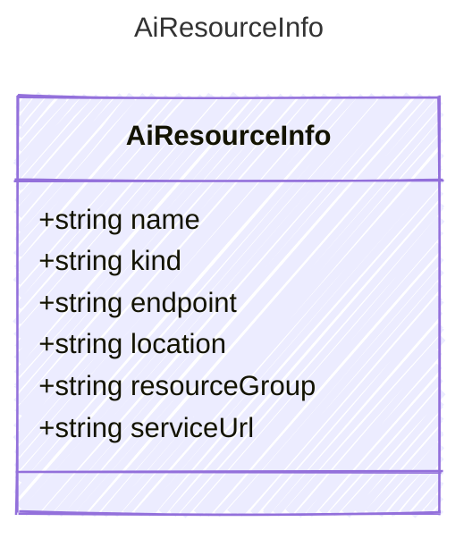

<!-- <auto-generated by typra-emitter> -->

An AI service resource that can host models or projects.

## Class Diagram



## Yaml Example

```yaml
serviceUrl: https://my-resource.services.ai.azure.com
```

## Properties

| Name | Type | Description |
| ---- | ---- | ----------- |
| name | string | Provider resource name |
| kind | string | Provider resource kind |
| endpoint | string | Inference endpoint |
| location | string | Provider region or location |
| resourceGroup | string | Provider resource group or equivalent administrative grouping |
| serviceUrl | string | Optional service root used to enumerate projects |
