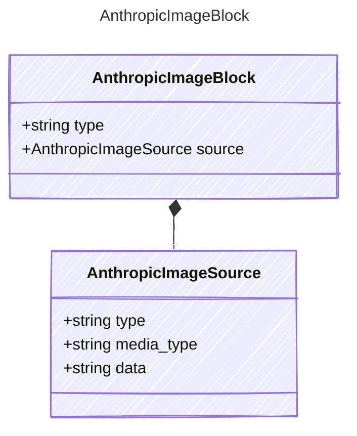

<!-- <auto-generated by typra-emitter> -->
---
title: "AnthropicImageBlock"
description: "Documentation for the AnthropicImageBlock type."
slug: "reference/anthropicimageblock"
---

An image content block using base64-encoded data.
Anthropic requires images as base64 with an explicit media type.

## Class Diagram

## Properties

| Name | Type | Description |
| ---- | ---- | ----------- |
| type | string | The content block type |
| source | [AnthropicImageSource](../anthropicimagesource/) | The image source (base64-encoded) |

## Composed Types

The following types are composed within `AnthropicImageBlock`:

- [AnthropicImageSource](../anthropicimagesource/)
