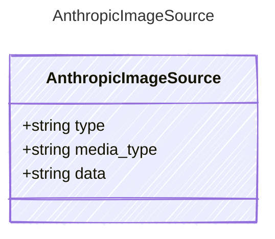

<!-- <auto-generated by typra-emitter> -->

Source descriptor for an Anthropic base64 image.

## Class Diagram



## Yaml Example

```yaml
media_type: image/png
data: iVBORw0KGgo...
```

## Properties

| Name | Type | Description |
| ---- | ---- | ----------- |
| type | string | The encoding type (always 'base64' for inline images) |
| media_type | string | The MIME type of the image (e.g., 'image/png', 'image/jpeg') |
| data | string | The base64-encoded image data |
