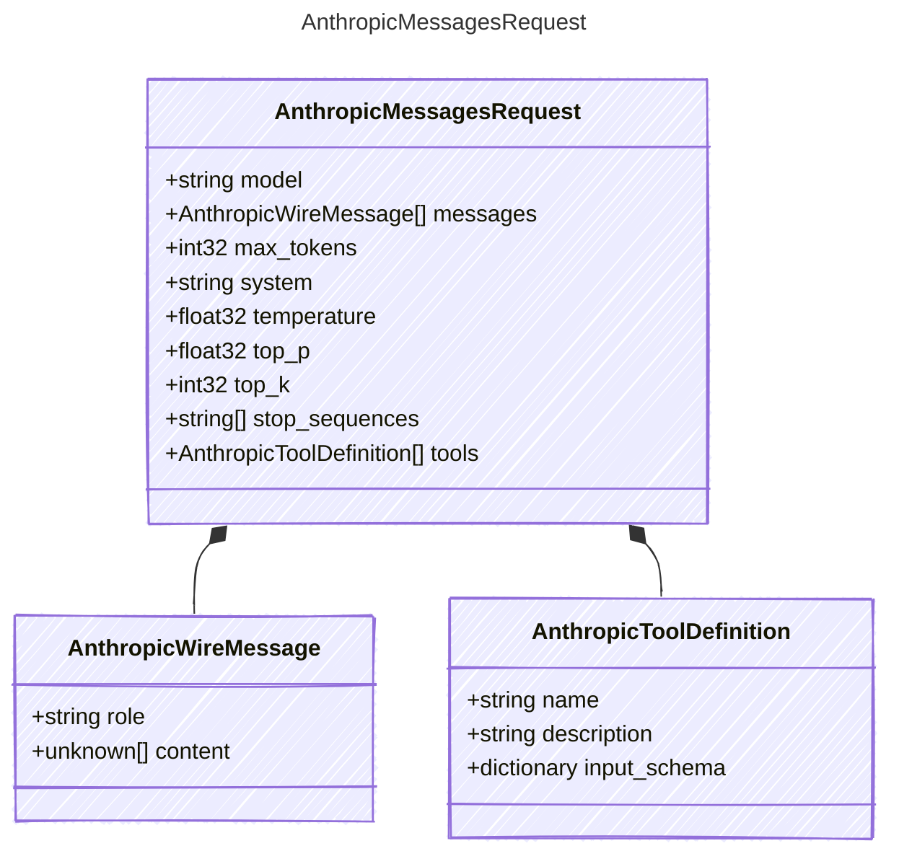

The full request body for the Anthropic Messages API (§7.5).

## Class Diagram



## Yaml Example

```yaml
model: claude-sonnet-4-20250514
max_tokens: 4096
system: You are a helpful assistant.
temperature: 0.7
top_p: 0.9
top_k: 40
stop_sequences:
  - |-
    

    Human:
```

## Properties

| Name | Type | Description |
| ---- | ---- | ----------- |
| model | string | The model identifier |
| messages | [AnthropicWireMessage[]](../anthropicwiremessage/) | The non-system messages to send |
| max_tokens | int32 | Maximum number of tokens to generate (required by Anthropic) |
| system | string | System prompt text (extracted from system-role messages) |
| temperature | float32 | Sampling temperature |
| top_p | float32 | Top-P sampling value |
| top_k | int32 | Top-K sampling value |
| stop_sequences | string[] | Stop sequences to end generation |
| tools | [AnthropicToolDefinition[]](../anthropictooldefinition/) | Tool definitions available to the model |

## Composed Types

The following types are composed within `AnthropicMessagesRequest`:

- [AnthropicWireMessage](../anthropicwiremessage/)
- [AnthropicToolDefinition](../anthropictooldefinition/)
