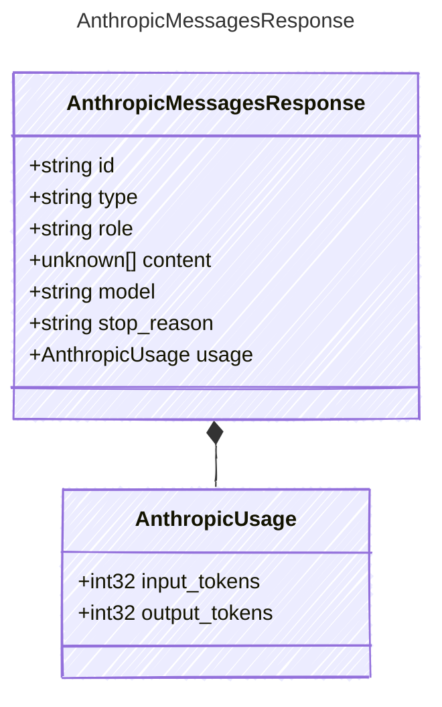

<!-- <auto-generated by typra-emitter> -->

The response body from the Anthropic Messages API.

## Class Diagram



## Yaml Example

```yaml
id: msg_01XFDUDYJgAACzvnptvVoYEL
model: claude-sonnet-4-20250514
stop_reason: end_turn
```

## Properties

| Name | Type | Description |
| ---- | ---- | ----------- |
| id | string | Unique response identifier |
| type | string | Object type (always 'message') |
| role | string | The role of the response (always 'assistant') |
| content | unknown[] | Array of content blocks in the response (AnthropicTextBlock | AnthropicToolUseBlock) |
| model | string | The model that generated the response |
| stop_reason | string | The reason generation stopped ('end_turn', 'max_tokens', 'stop_sequence', 'tool_use') |
| usage | [AnthropicUsage](../anthropicusage/) | Token usage statistics |

## Composed Types

The following types are composed within `AnthropicMessagesResponse`:

- [AnthropicUsage](../anthropicusage/)
