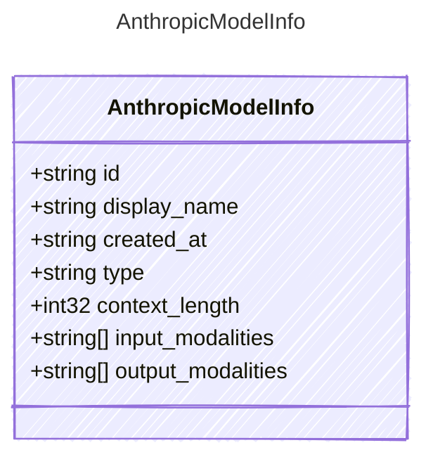

<!-- <auto-generated by typra-emitter> -->

A model entry returned by Anthropic's model listing API.

## Class Diagram

## Properties

| Name | Type | Description |
| ---- | ---- | ----------- |
| id | string | The model identifier |
| display_name | string | The human-readable model name |
| created_at | string | The RFC 3339 timestamp when the model was created |
| type | string | The API object type |
| context_length | int32 | The model context window when supplied by the endpoint |
| input_modalities | string[] | Input modalities when supplied by the endpoint |
| output_modalities | string[] | Output modalities when supplied by the endpoint |
