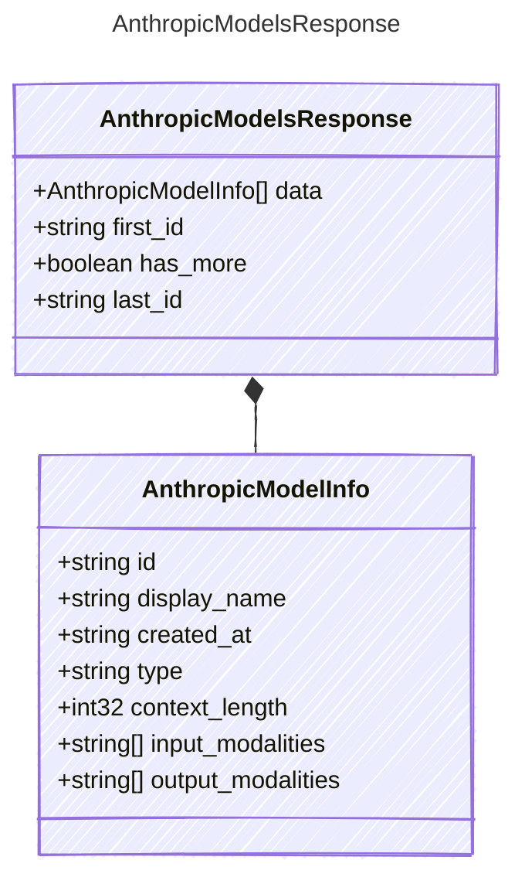

<!-- <auto-generated by typra-emitter> -->

The response body from Anthropic's model listing API.

## Class Diagram

## Properties

| Name | Type | Description |
| ---- | ---- | ----------- |
| data | [AnthropicModelInfo[]](../anthropicmodelinfo/) | Models available to the authenticated caller |
| first_id | string | The first model identifier in this page |
| has_more | boolean | Whether another page is available |
| last_id | string | The last model identifier in this page |

## Composed Types

The following types are composed within `AnthropicModelsResponse`:

- [AnthropicModelInfo](../anthropicmodelinfo/)
