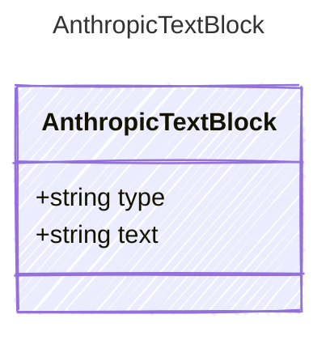

<!-- <auto-generated by typra-emitter> -->
---
title: "AnthropicTextBlock"
description: "Documentation for the AnthropicTextBlock type."
slug: "reference/anthropictextblock"
---

A text content block in Anthropic's array-of-blocks message format.

## Class Diagram



## Yaml Example

```yaml
text: Hello, how can I help?
```

## Properties

| Name | Type | Description |
| ---- | ---- | ----------- |
| type | string | The content block type |
| text | string | The text content |
