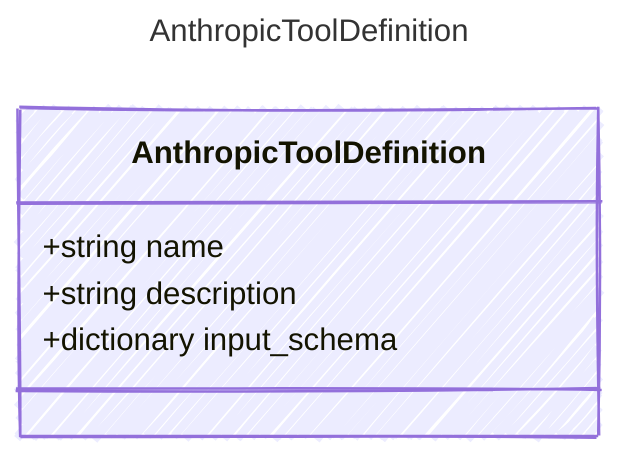

<!-- <auto-generated by typra-emitter> -->
---
title: "AnthropicToolDefinition"
description: "Documentation for the AnthropicToolDefinition type."
slug: "reference/anthropictooldefinition"
---

A tool definition in Anthropic's format. Unlike OpenAI which wraps
tools in `{type: "function", function: {...}}`, Anthropic uses a
flat structure with `input_schema` (§7.5).

## Class Diagram



## Yaml Example

```yaml
name: get_weather
description: Get the current weather for a city
```

## Properties

| Name | Type | Description |
| ---- | ---- | ----------- |
| name | string | The tool name |
| description | string | A description of what the tool does |
| input_schema | dictionary | JSON Schema describing the tool's input parameters |
