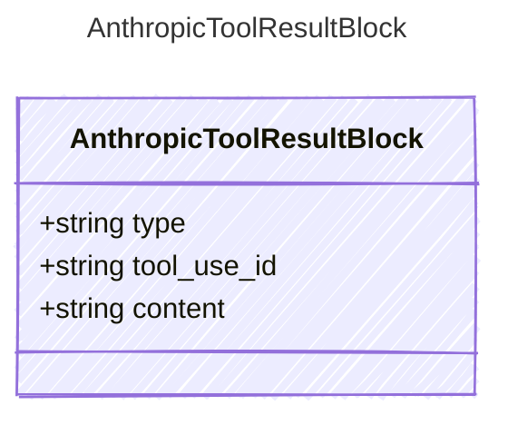

<!-- <auto-generated by typra-emitter> -->

A tool result content block sent back to the API with the tool's output.

## Class Diagram



## Yaml Example

```yaml
tool_use_id: toolu_01A09q90qw90lq917835lq9
content: 72°F and sunny in Paris
```

## Properties

| Name | Type | Description |
| ---- | ---- | ----------- |
| type | string | The content block type |
| tool_use_id | string | The tool_use id this result corresponds to |
| content | string | The tool's output content |
