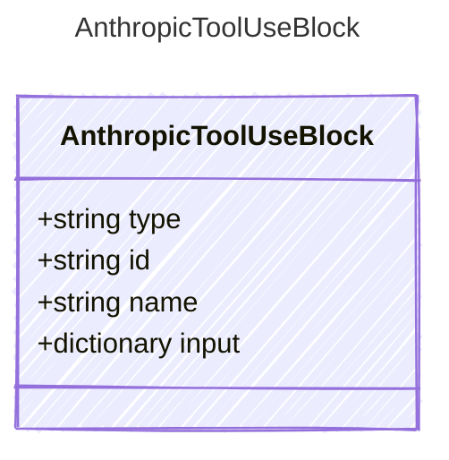

<!-- <auto-generated by typra-emitter> -->

A tool use content block returned in an assistant message when
the model wants to invoke a tool.

## Class Diagram



## Yaml Example

```yaml
id: toolu_01A09q90qw90lq917835lq9
name: get_weather
input:
  city: Paris
```

## Properties

| Name | Type | Description |
| ---- | ---- | ----------- |
| type | string | The content block type |
| id | string | Unique identifier for this tool invocation |
| name | string | The name of the tool to invoke |
| input | dictionary | The JSON arguments for the tool call |
