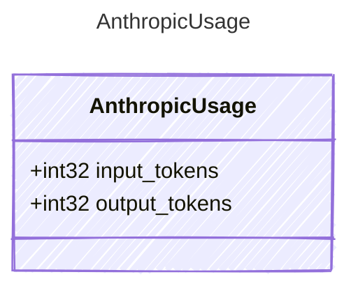

<!-- <auto-generated by typra-emitter> -->

Usage statistics returned in an Anthropic Messages API response.

## Class Diagram



## Yaml Example

```yaml
input_tokens: 150
output_tokens: 42
```

## Properties

| Name | Type | Description |
| ---- | ---- | ----------- |
| input_tokens | int32 | Number of input tokens consumed |
| output_tokens | int32 | Number of output tokens generated |
