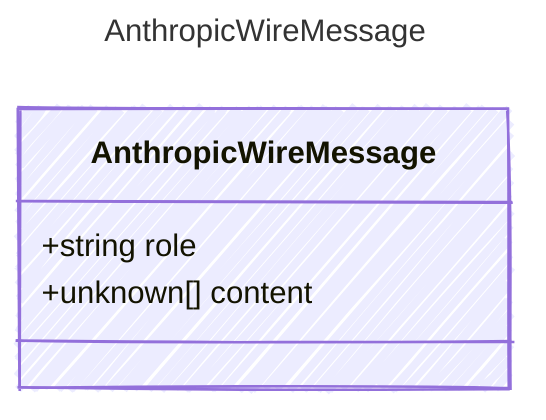

A single message in the Anthropic Messages API wire format.
Anthropic always uses the array-of-blocks form for content,
even when there is only one text block (§7.5).

## Class Diagram



## Yaml Example

```yaml
role: user
```

## Properties

| Name | Type | Description |
| ---- | ---- | ----------- |
| role | string | The message role ('user' or 'assistant') |
| content | unknown[] | Array of typed content blocks (AnthropicTextBlock | AnthropicImageBlock | AnthropicToolUseBlock | AnthropicToolResultBlock) |
