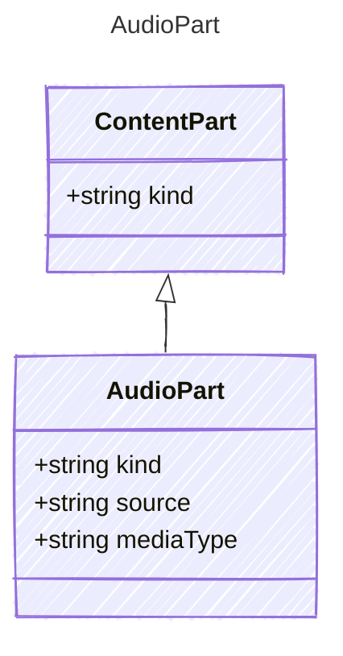

An audio content part. The source may be a URL or base64-encoded data.

## Class Diagram



## Yaml Example

```yaml
source: https://example.com/audio.wav
mediaType: audio/wav
```

## Properties

| Name | Type | Description |
| ---- | ---- | ----------- |
| kind | string | The kind identifier for audio content |
| source | string | URL or base64-encoded audio data |
| mediaType | string | MIME type of the audio (e.g., 'audio/wav') |
