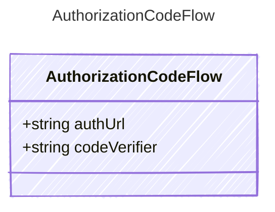

<!-- <auto-generated by typra-emitter> -->

Provider-neutral initialization result for an authorization-code flow.

## Class Diagram

## Properties

| Name | Type | Description |
| ---- | ---- | ----------- |
| authUrl | string | The authorization URL the host opens for the user |
| codeVerifier | string | The PKCE verifier retained by the host for token exchange |
