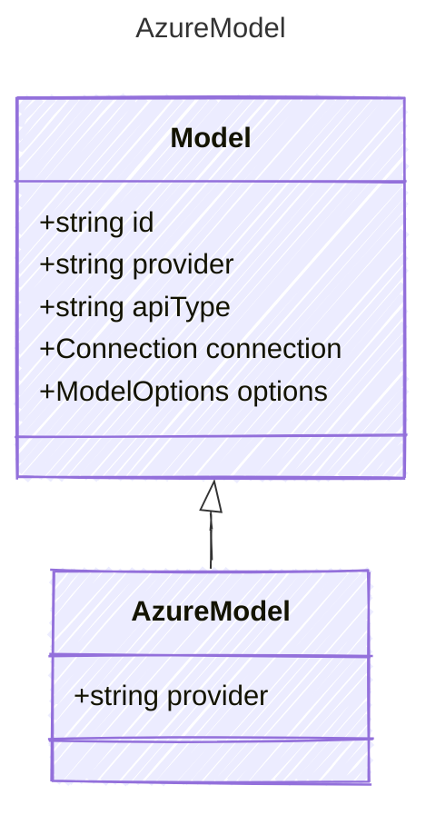

<!-- <auto-generated by typra-emitter> -->

Azure OpenAI-hosted model. Pin-only subtype.

## Class Diagram

## Properties

| Name | Type | Description |
| ---- | ---- | ----------- |
| provider | string | The Azure provider discriminator |
