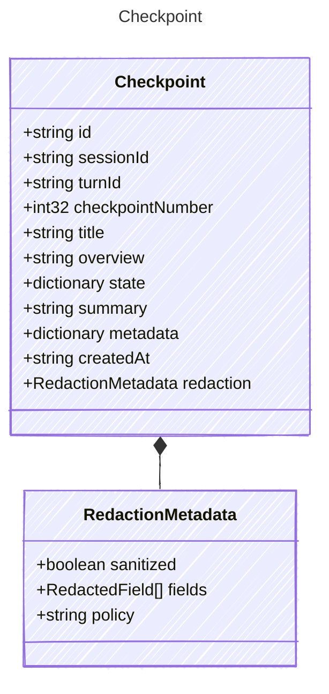

<!-- <auto-generated by typra-emitter> -->

A persisted handoff point for a harness session.

## Class Diagram



## Yaml Example

```yaml
id: chk_abc123
sessionId: sess_abc123
turnId: turn_001
checkpointNumber: 3
title: Added harness contracts
createdAt: 2026-06-09T20:00:00Z
```

## Properties

| Name | Type | Description |
| ---- | ---- | ----------- |
| id | string | Stable checkpoint identifier |
| sessionId | string | Stable session identifier |
| turnId | string | Associated turn identifier, when the checkpoint was created inside a turn |
| checkpointNumber | int32 | Monotonic checkpoint number within the session |
| title | string | Short checkpoint title |
| overview | string | Short human-readable overview |
| state | dictionary | Portable checkpoint state needed to resume or hand off the session |
| summary | string | Optional host-authored summary or handoff note |
| metadata | dictionary | Host-defined checkpoint metadata |
| createdAt | string | ISO 8601 UTC timestamp when the checkpoint was created |
| redaction | [RedactionMetadata](../redactionmetadata/) | Redaction state for sensitive checkpoint fields |

## Composed Types

The following types are composed within `Checkpoint`:

- [RedactionMetadata](../redactionmetadata/)
