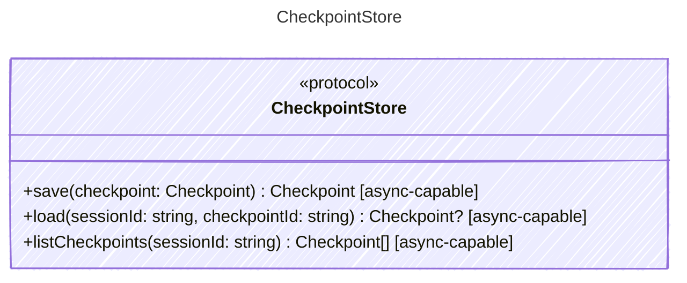

<!-- <auto-generated by typra-emitter> -->
---
title: "CheckpointStore"
description: "Documentation for the CheckpointStore type."
slug: "reference/checkpointstore"
---

Stores and retrieves resumable session checkpoints.

## Class Diagram

## Helper Methods

The following helper methods are declared via `@method` and must be implemented by every runtime. The schema declares the logical protocol contract; each runtime maps async-capable methods to idiomatic sync/async shapes for that language.

| Name | Signature | Runtime shape | Description |
| ---- | --------- | ------------- | ----------- |
| `save` | `save(checkpoint: Checkpoint) -> Checkpoint` | async-capable | Persist a session checkpoint and return the stored checkpoint |
| `load` | `load(sessionId: string, checkpointId: string) -> Checkpoint?` | async-capable | Load a checkpoint by session and checkpoint identifier |
| `listCheckpoints` | `listCheckpoints(sessionId: string) -> Checkpoint[]` | async-capable | List checkpoints for a session |
