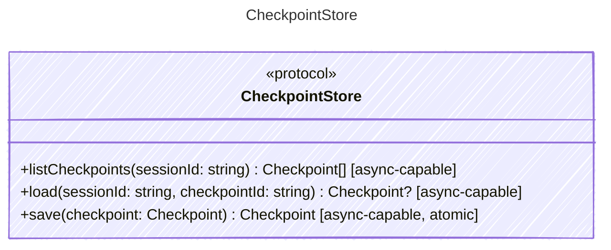

<!-- <auto-generated by typra-emitter> -->

Stores and retrieves resumable session checkpoints.

## Class Diagram

```mermaid
---
title: CheckpointStore
config:
  look: handDrawn
  theme: colorful
  class:
    hideEmptyMembersBox: true
---
classDiagram
    class CheckpointStore {
      <<protocol>>
        +listCheckpoints(sessionId: string) Checkpoint[] [async-capable]
        +load(sessionId: string, checkpointId: string) Checkpoint? [async-capable]
        +save(checkpoint: Checkpoint) Checkpoint [async-capable, atomic]
    }
```

## Helper Methods

The following helper methods are declared via `@method` and must be implemented by every runtime. The schema declares the logical protocol contract; each runtime maps async-capable methods to idiomatic sync/async shapes for that language.

| Name | Signature | Runtime shape | Description |
| ---- | --------- | ------------- | ----------- |
| `listCheckpoints` | `listCheckpoints(sessionId: string) -> Checkpoint[]` | async-capable | List checkpoints for a session |
| `load` | `load(sessionId: string, checkpointId: string) -> Checkpoint?` | async-capable | Load a checkpoint by session and checkpoint identifier |
| `save` | `save(checkpoint: Checkpoint) -> Checkpoint` | async-capable, atomic | Persist a session checkpoint and return the stored checkpoint |
