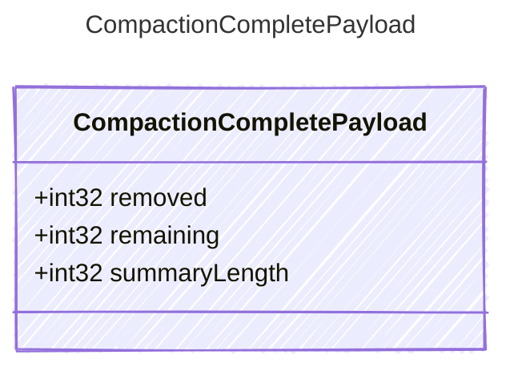

<!-- <auto-generated by typra-emitter> -->

Payload for "compaction_complete" events — context compaction finished.

## Class Diagram



## Yaml Example

```yaml
removed: 5
remaining: 3
summaryLength: 1200
```

## Properties

| Name | Type | Description |
| ---- | ---- | ----------- |
| removed | int32 | Number of messages removed during compaction |
| remaining | int32 | Number of messages remaining after compaction |
| summaryLength | int32 | Length of the generated summary, when a summarization strategy is used |
