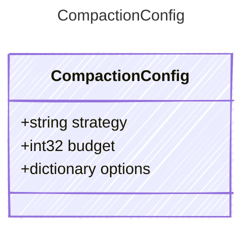

<!-- <auto-generated by typra-emitter> -->
---
title: "CompactionConfig"
description: "Documentation for the CompactionConfig type."
slug: "reference/compactionconfig"
---

Configuration for context window compaction. When the message history
exceeds the context budget, the compaction strategy is applied to
reduce the message list while preserving essential information.

## Class Diagram



## Yaml Example

```yaml
strategy: summarize
budget: 50000
options:
  preserveSystemMessages: true
```

## Properties

| Name | Type | Description |
| ---- | ---- | ----------- |
| strategy | string | The compaction strategy identifier. Built-in strategies include 'summarize'. Can also be a path to a .prompty file used as the summarization prompt. |
| budget | int32 | Character budget for the compacted context. Overrides TurnOptions.contextBudget when set. |
| options | dictionary | Additional strategy-specific options |
