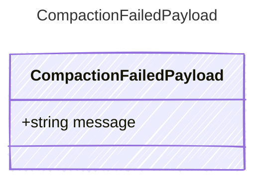

<!-- <auto-generated by typra-emitter> -->

Payload for "compaction_failed" events — compaction could not be completed.

## Class Diagram



## Yaml Example

```yaml
message: Summarization prompt exceeded context window
```

## Properties

| Name | Type | Description |
| ---- | ---- | ----------- |
| message | string | Explanation of why compaction failed |
