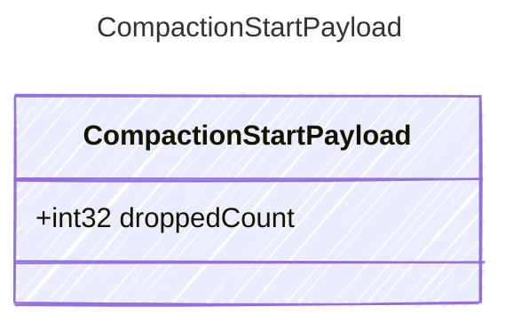

<!-- <auto-generated by typra-emitter> -->

Payload for "compaction_start" events — context compaction is beginning.

## Class Diagram



## Yaml Example

```yaml
droppedCount: 5
```

## Properties

| Name | Type | Description |
| ---- | ---- | ----------- |
| droppedCount | int32 | Number of messages selected for compaction |
