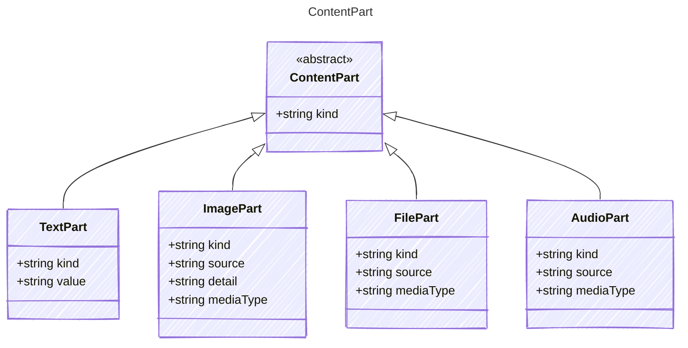

<!-- <auto-generated by typra-emitter> -->
---
title: "ContentPart"
description: "Documentation for the ContentPart type."
slug: "reference/contentpart"
---

A part of a message's content. Content parts are discriminated on the `kind`
field and represent the different modalities that can appear in a message.

## Class Diagram

## Properties

| Name | Type | Description |
| ---- | ---- | ----------- |
| kind | string | The kind of content part |

## Child Types

The following types extend `ContentPart`:

- [TextPart](../textpart/)
- [ImagePart](../imagepart/)
- [FilePart](../filepart/)
- [AudioPart](../audiopart/)
