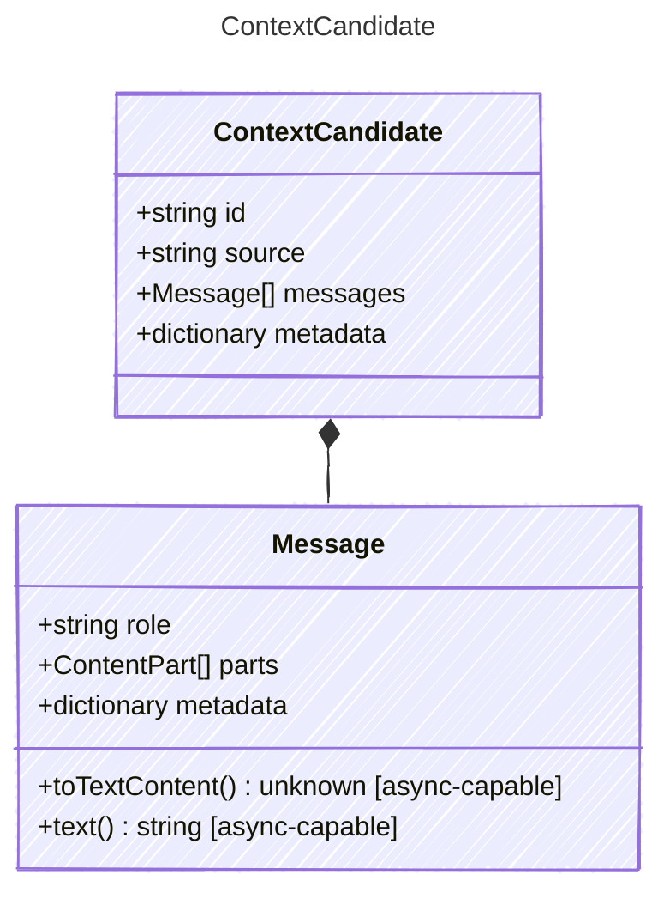

<!-- <auto-generated by typra-emitter> -->

A context contribution before filtering, ranking, and packing.

## Class Diagram



## Yaml Example

```yaml
id: memory:project-plan
source: memory
```

## Properties

| Name | Type | Description |
| ---- | ---- | ----------- |
| id | string | Stable candidate identifier |
| source | string | Host-defined source of the candidate |
| messages | [Message[]](../message/) | Messages contributed by the candidate |
| metadata | dictionary | Opaque host-specific candidate metadata |

## Composed Types

The following types are composed within `ContextCandidate`:

- [Message](../message/)
