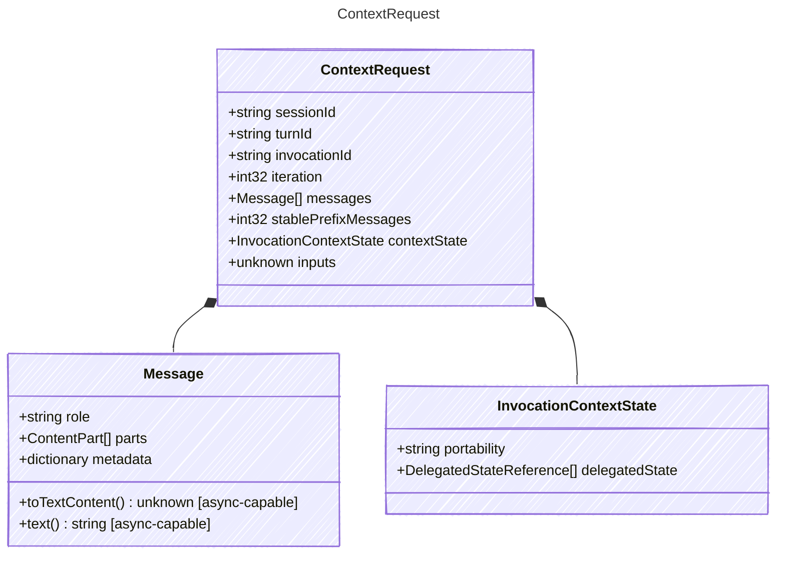

<!-- <auto-generated by typra-emitter> -->

Planning input handed to the context pipeline before one model invocation.

## Class Diagram

## Properties

| Name | Type | Description |
| ---- | ---- | ----------- |
| sessionId | string | Stable session identifier |
| turnId | string | Stable turn identifier |
| invocationId | string | Stable model invocation identifier |
| iteration | int32 | Zero-based model loop iteration |
| messages | [Message[]](../message/) | Canonical messages entering context planning |
| stablePrefixMessages | int32 | Number of leading messages eligible for provider prefix-cache reuse |
| contextState | [InvocationContextState](../invocationcontextstate/) | Provider-context state entering this invocation |
| inputs | unknown | Turn inputs |

## Composed Types

The following types are composed within `ContextRequest`:

- [Message](../message/)
- [InvocationContextState](../invocationcontextstate/)
