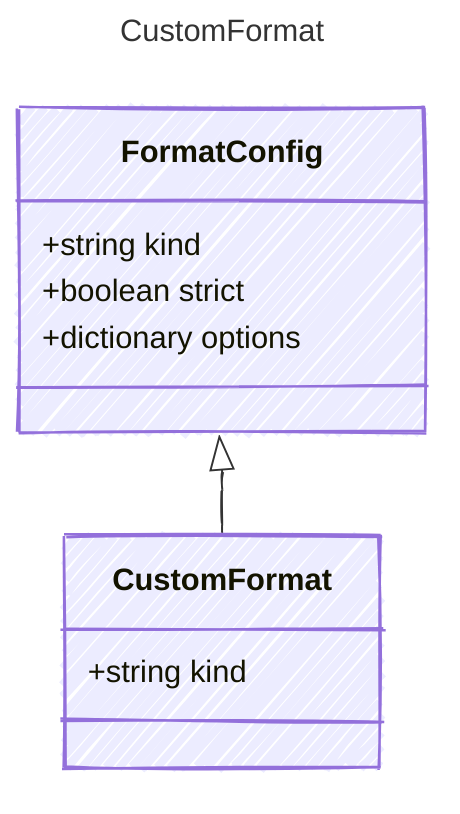

<!-- <auto-generated by typra-emitter> -->

Wildcard catch-all format for downstream/unregistered template dialects. The
`"*"` discriminator lowers to the Renderer dispatch decl's `defaultVariant`.

## Class Diagram

## Properties

| Name | Type | Description |
| ---- | ---- | ----------- |
| kind | string | The wildcard format discriminator for any dialect not explicitly modeled |
