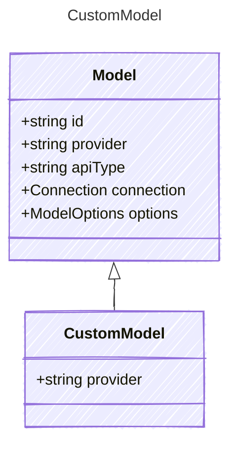

<!-- <auto-generated by typra-emitter> -->

Wildcard catch-all model for downstream/unregistered providers. The `"*"`
discriminator lowers to the dispatch decl's `defaultVariant` (the fallback
seam) while the known providers stay enumerated `variants`. A runtime provider
value that is none of the known literals routes here — the downstream-registry
delegation hook.

## Class Diagram

## Properties

| Name | Type | Description |
| ---- | ---- | ----------- |
| provider | string | The wildcard provider discriminator for any provider not explicitly modeled |
