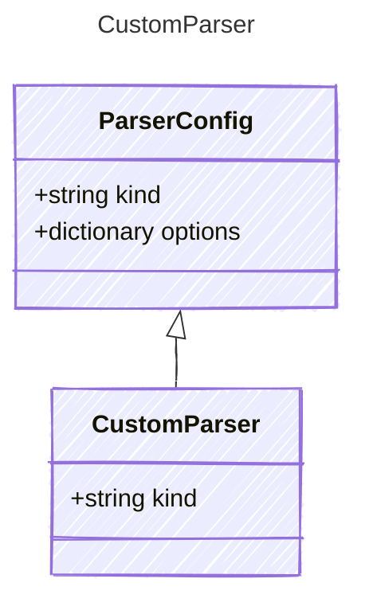

<!-- <auto-generated by typra-emitter> -->

Wildcard catch-all parser for downstream/unregistered parser kinds. The `"*"`
discriminator lowers to the Parser dispatch decl's `defaultVariant`.

## Class Diagram

## Properties

| Name | Type | Description |
| ---- | ---- | ----------- |
| kind | string | The wildcard parser discriminator for any kind not explicitly modeled |
