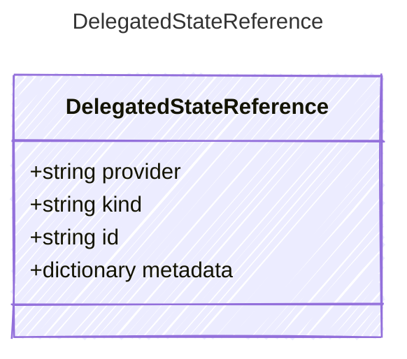

<!-- <auto-generated by typra-emitter> -->

A reference to model-visible state retained by a provider.

## Class Diagram



## Yaml Example

```yaml
provider: openai
kind: response
id: resp_abc123
```

## Properties

| Name | Type | Description |
| ---- | ---- | ----------- |
| provider | string | Provider that owns the retained state |
| kind | string | Provider-defined kind of retained state |
| id | string | Provider-defined identifier for the retained state |
| metadata | dictionary | Opaque provider-specific state reference metadata |
