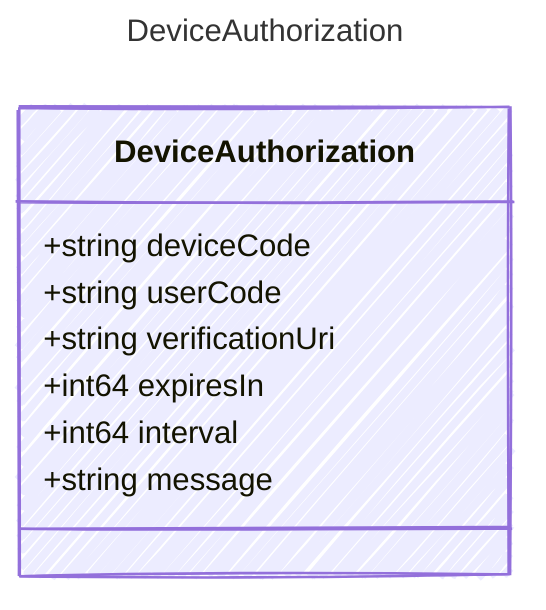

<!-- <auto-generated by typra-emitter> -->

Provider-neutral device authorization challenge shown to a user.

## Class Diagram

## Properties

| Name | Type | Description |
| ---- | ---- | ----------- |
| deviceCode | string | The device code used when polling the token endpoint |
| userCode | string | The short code the user enters at the verification URI |
| verificationUri | string | The URI where the user authorizes the device |
| expiresIn | int64 | Lifetime of the device authorization in seconds |
| interval | int64 | Minimum polling interval in seconds |
| message | string | Human-readable authorization instructions |
