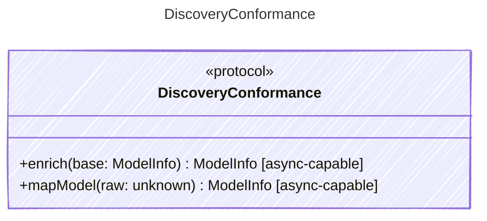

<!-- <auto-generated by typra-emitter> -->

Conformance-only seam that hosts the model-discovery behavior vectors:
mapping raw provider discovery payloads into canonical ModelInfo, and
enriching sparse results from the shared model-capability dataset. Both
algorithms are validated independently and identically across runtimes.

This interface exists purely to carry

## Class Diagram

## Helper Methods

The following helper methods are declared via `@method` and must be implemented by every runtime. The schema declares the logical protocol contract; each runtime maps async-capable methods to idiomatic sync/async shapes for that language.

| Name | Signature | Runtime shape | Description |
| ---- | --------- | ------------- | ----------- |
| `enrich` | `enrich(base: ModelInfo) -> ModelInfo` | async-capable | Fill only-missing ModelInfo fields from the shared capability dataset |
| `mapModel` | `mapModel(raw: unknown) -> ModelInfo` | async-capable | Map a raw provider model/deployment/catalog payload to canonical ModelInfo |
