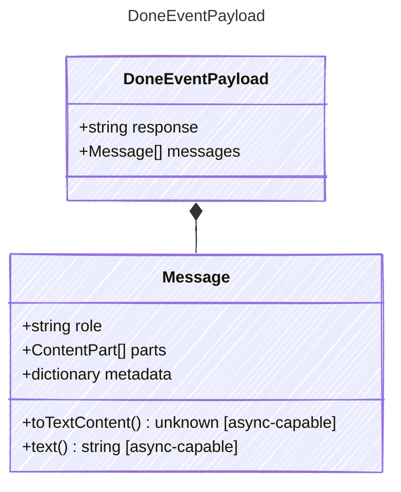

Payload for "done" events — the agent loop completed successfully.

## Class Diagram



## Yaml Example

```yaml
response: The weather in Paris is 72°F and sunny.
```

## Properties

| Name | Type | Description |
| ---- | ---- | ----------- |
| response | string | The final text response from the LLM |
| messages | [Message[]](../message/) | The final conversation state including all messages |

## Composed Types

The following types are composed within `DoneEventPayload`:

- [Message](../message/)
