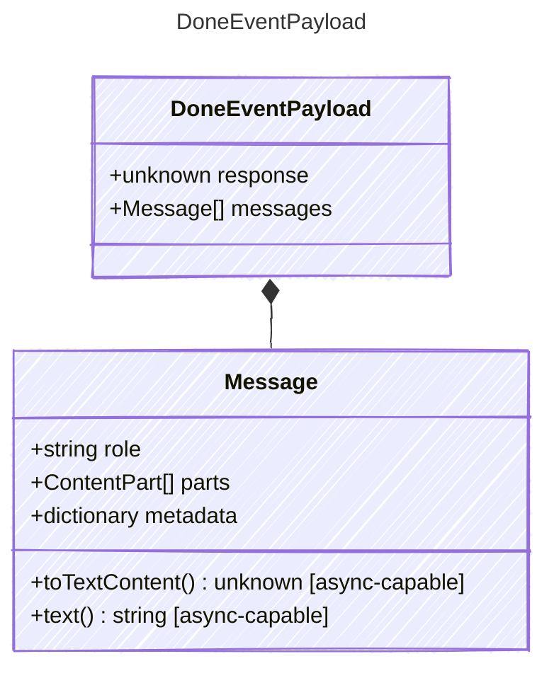

<!-- <auto-generated by typra-emitter> -->

Payload for "done" events — the agent loop completed successfully.

## Class Diagram

## Properties

| Name | Type | Description |
| ---- | ---- | ----------- |
| response | unknown | The final response from the LLM after processing |
| messages | [Message[]](../message/) | The final conversation state including all messages |

## Composed Types

The following types are composed within `DoneEventPayload`:

- [Message](../message/)
