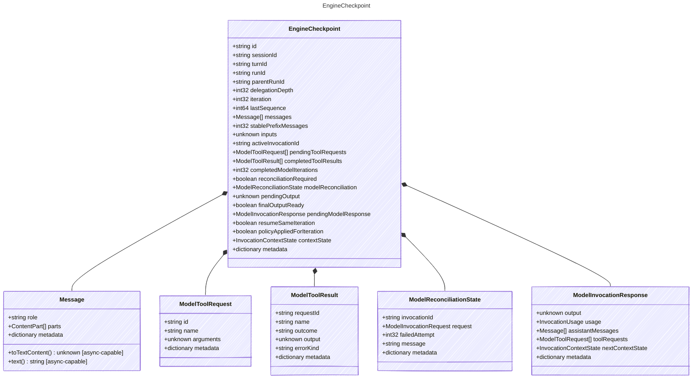

<!-- <auto-generated by typra-emitter> -->

Portable durable checkpoint emitted after a committed model/tool round.

A resumed run rebuilt from a checkpoint MUST NOT duplicate a model or tool
effect that the checkpoint already records as committed. Run identity is
carried so delegated runs checkpoint independently under their own run.

## Class Diagram



## Yaml Example

```yaml
id: ckpt_abc123
sessionId: sess_abc123
turnId: turn_abc123
runId: run_abc123
```

## Properties

| Name | Type | Description |
| ---- | ---- | ----------- |
| id | string | Stable unique identifier for this checkpoint |
| sessionId | string | Stable session identifier |
| turnId | string | Stable turn identifier |
| runId | string | Stable identifier of this engine run |
| parentRunId | string | Run identifier of the parent run when this run was delegated |
| delegationDepth | int32 | Zero-based delegation nesting depth; 0 for a top-level run |
| iteration | int32 | Zero-based model loop iteration captured by this checkpoint |
| lastSequence | int64 | Last committed event sequence included in this checkpoint |
| messages | [Message[]](../message/) | Canonical conversation messages at checkpoint time |
| stablePrefixMessages | int32 | Number of leading messages eligible for provider prefix-cache reuse |
| inputs | unknown | Turn inputs captured for deterministic resume |
| activeInvocationId | string | Active model invocation identifier, when one is in flight |
| pendingToolRequests | [ModelToolRequest[]](../modeltoolrequest/) | Tool requests awaiting execution or commitment |
| completedToolResults | [ModelToolResult[]](../modeltoolresult/) | Tool results already executed in this round |
| completedModelIterations | int32 | Number of fully completed model iterations |
| reconciliationRequired | boolean | Whether the turn is blocked pending model outcome reconciliation |
| modelReconciliation | [ModelReconciliationState](../modelreconciliationstate/) | Typed provider state when model outcome reconciliation is required |
| pendingOutput | unknown | Final output pending commit, when computed |
| finalOutputReady | boolean | Whether the final output is ready to commit |
| pendingModelResponse | [ModelInvocationResponse](../modelinvocationresponse/) | Model response retained until all tool results form one conversation batch |
| resumeSameIteration | boolean | Resume this exact iteration because the checkpoint precedes an external model effect |
| policyAppliedForIteration | boolean | Whether the host policy rewrite is already durable for this iteration |
| contextState | [InvocationContextState](../invocationcontextstate/) | Provider-context state carried by this checkpoint |
| metadata | dictionary | Opaque host-specific checkpoint metadata |

## Composed Types

The following types are composed within `EngineCheckpoint`:

- [Message](../message/)
- [ModelToolRequest](../modeltoolrequest/)
- [ModelToolResult](../modeltoolresult/)
- [ModelReconciliationState](../modelreconciliationstate/)
- [ModelInvocationResponse](../modelinvocationresponse/)
