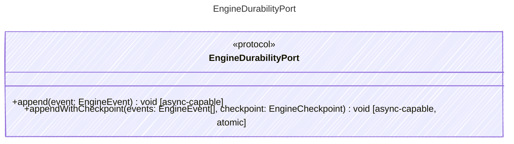

<!-- <auto-generated by typra-emitter> -->

Persists semantic engine events and checkpoints without runtime cancellation.

## Class Diagram

## Helper Methods

The following helper methods are declared via `@method` and must be implemented by every runtime. The schema declares the logical protocol contract; each runtime maps async-capable methods to idiomatic sync/async shapes for that language.

| Name | Signature | Runtime shape | Description |
| ---- | --------- | ------------- | ----------- |
| `append` | `append(event: EngineEvent) -> void` | async-capable | Append one semantic engine event durably |
| `appendWithCheckpoint` | `appendWithCheckpoint(events: EngineEvent[], checkpoint: EngineCheckpoint) -> void` | async-capable, atomic | Atomically append semantic engine events and persist the checkpoint that reflects them |
