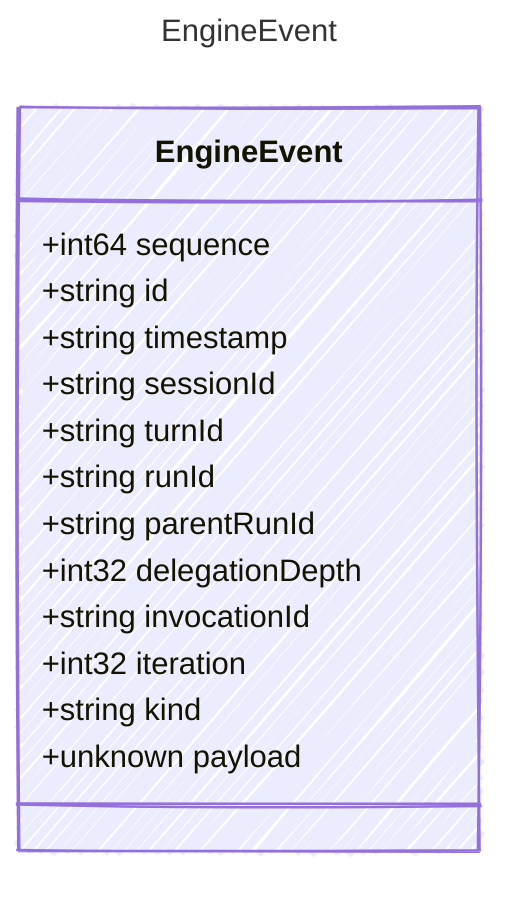

<!-- <auto-generated by typra-emitter> -->

One event in the monotonic semantic event stream of a turn.

Events are the durable, replayable record a DurabilityPort persists. Run
identity links delegated (nested) engine runs to their parent for
cross-run observability.

## Class Diagram



## Yaml Example

```yaml
id: evt_abc123
timestamp: 2025-01-01T00:00:00Z
sessionId: sess_abc123
turnId: turn_abc123
runId: run_abc123
```

## Properties

| Name | Type | Description |
| ---- | ---- | ----------- |
| sequence | int64 | Monotonic sequence number within the run, starting at one |
| id | string | Stable unique identifier for this event |
| timestamp | string | RFC 3339 timestamp when the event was emitted |
| sessionId | string | Stable session identifier |
| turnId | string | Stable turn identifier |
| runId | string | Stable identifier of this engine run |
| parentRunId | string | Run identifier of the parent run when this run was delegated |
| delegationDepth | int32 | Zero-based delegation nesting depth; 0 for a top-level run |
| invocationId | string | Model invocation identifier, when the event belongs to an invocation |
| iteration | int32 | Zero-based model loop iteration, when applicable |
| kind | string | Semantic kind of this event |
| payload | unknown | Opaque event-specific payload |
