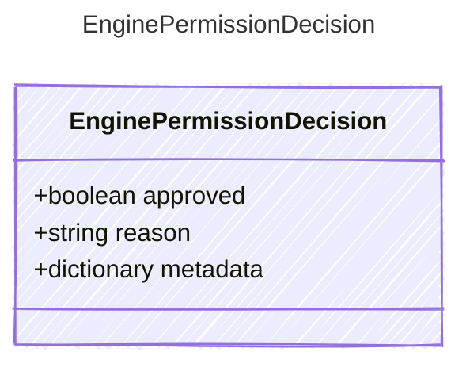

<!-- <auto-generated by typra-emitter> -->

A permission decision for one tool request.

## Class Diagram

## Properties

| Name | Type | Description |
| ---- | ---- | ----------- |
| approved | boolean | Whether the tool request is authorized to execute |
| reason | string | Human-readable reason for the decision |
| metadata | dictionary | Opaque host-specific permission metadata |
